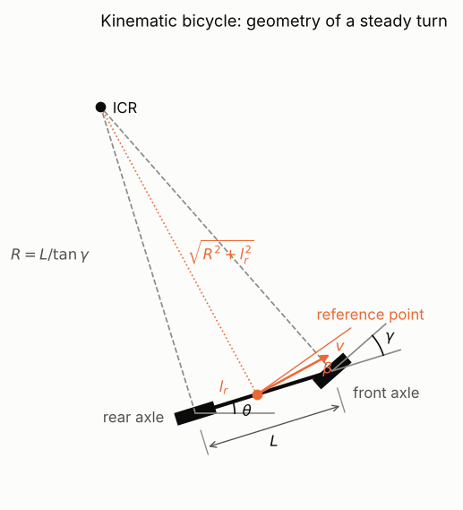
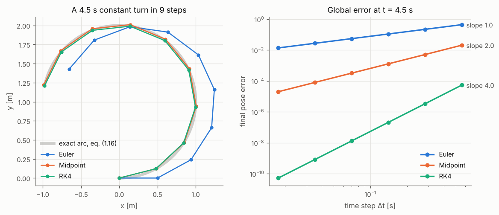
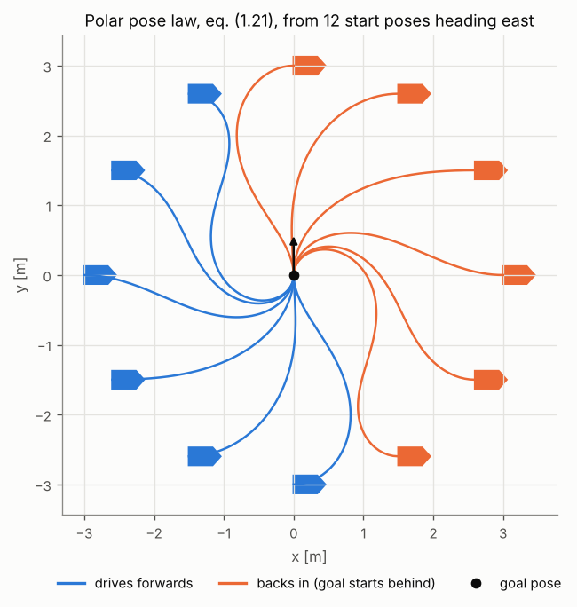

# 1 · Vehicle kinematic models

A planner produces a path; a vehicle has to drive it. Before planning anything we need a model that says how
the controls a vehicle accepts — wheel speeds, a forward speed and a steering angle — move it through the
plane. This chapter derives the three models used in the rest of the module (unicycle, differential drive,
kinematic bicycle), shows why they cannot move sideways and what that costs, integrates them numerically, and
closes the loop with two simple controllers that drive a model to a point and to a pose.

Code: [`kinematics.hpp`](../cpp/include/motion_planning/kinematics.hpp),
[`pose_control.hpp`](../cpp/include/motion_planning/pose_control.hpp) ·
Tests: [`test_kinematics.cpp`](../cpp/tests/test_kinematics.cpp),
[`test_pose_control.cpp`](../cpp/tests/test_pose_control.cpp) ·
Notebook: [`01_vehicle_kinematics.ipynb`](../2_notebooks/exercises/01_vehicle_kinematics.ipynb)

## 1.1 Configuration

A rigid vehicle moving on a plane has three degrees of freedom. We describe them by the pose of one chosen
*reference point* of the vehicle in the world frame $\{W\}$:

$$
q = \begin{pmatrix} x \\ y \\ \theta \end{pmatrix} \in \mathbb{R}^2 \times S^1 ,
\tag{1.1}
$$

where $(x, y)$ is the position of the reference point and $\theta$ the angle from the world $x$ axis to the
vehicle's forward axis. The vehicle frame $\{V\}$ has its origin at the reference point, $x$ forward and $y$ to
the left. Which point we choose matters: we will see that the rear-axle midpoint makes the models simplest.

A *kinematic* model gives $\dot q$ as a function of $q$ and of the inputs $u$, $\dot q = f(q, u)$. It ignores
masses, forces and tyre slip. That is accurate at the speeds of indoor robots and of cars manoeuvring, and it
is what every planner in this module assumes.

## 1.2 Unicycle

The simplest wheeled vehicle is a single upright wheel that can roll forwards and spin about its vertical axis.
In its own frame the reference point moves only forwards, ${}^V\dot x = v$, ${}^V\dot y = 0$, and the frame
turns at the yaw rate $\omega$. Rotating the body velocity $(v, 0)$ into $\{W\}$ by $\theta$:

$$
\dot x = v\cos\theta, \qquad \dot y = v\sin\theta, \qquad \dot\theta = \omega,
\qquad u = (v, \omega).
\tag{1.2}
$$

Nothing physical is a unicycle, but differential-drive robots and cars reduce to it after a change of inputs,
so controllers and planners are written for (1.2) and the inputs converted at the end.

## 1.3 Differential drive

Two independently driven wheels of radius $r$ share one axle; their contact points are $b$ apart (the track
width). Castors carry the rest of the weight and impose no constraint. Take the axle midpoint as the reference
point.

If a wheel rolls without slipping, its centre moves at $r$ times its angular speed. A rigid body turning at
$\omega$ and translating at $v$ moves a point at lateral offset $\pm b/2$ forwards at $v \pm \omega b/2$, so

$$
r\omega_R = v + \tfrac{b}{2}\omega, \qquad r\omega_L = v - \tfrac{b}{2}\omega .
$$

Adding and subtracting the two:

$$
v = \frac{r(\omega_R + \omega_L)}{2}, \qquad \omega = \frac{r(\omega_R - \omega_L)}{b},
\tag{1.3}
$$

$$
\omega_L = \frac{v - \omega b/2}{r}, \qquad \omega_R = \frac{v + \omega b/2}{r}.
\tag{1.4}
$$

Substituting (1.3) into (1.2) gives the model in wheel speeds. Equal speeds drive straight; opposite speeds turn
on the spot ($v = 0$), something no car can do. The instantaneous centre of rotation (ICR) lies on the axle line
at distance $v/\omega$ from the midpoint.

**Worked example.** With $r = 0.033$ m, $b = 0.160$ m (the size of a small educational robot) and wheel speeds
$\omega_L = 5$ rad/s, $\omega_R = 10$ rad/s, eq. (1.3) gives $v = 0.033 \cdot 7.5 = 0.2475$ m/s and
$\omega = 0.033 \cdot 5 / 0.160 = 1.03125$ rad/s. (Checked in `test_kinematics.cpp`.)

## 1.4 Kinematic bicycle

A car has four wheels, but if each axle's two wheels are lumped into one wheel at the axle midpoint the
geometry is that of a bicycle: a rear wheel fixed to the body and a front wheel steered by the angle $\gamma$,
the two axles $L$ apart (the wheelbase). This is the standard reduction of the Ackermann geometry: a correctly
built Ackermann linkage steers the two front wheels so that their axes meet the rear-axle line at one point,
which is exactly the bicycle's ICR.

*Both wheels roll without sideways slip, so each wheel's velocity lies in its plane and the ICR is where the
two wheel axes meet. Figure: `tools/figures/fig_01_vehicle_kinematics.py`.*

**Rear-axle reference point.** The rear wheel's velocity is along the body axis, so the ICR lies on the rear
axle line, at some distance $R$. The front wheel's velocity is at angle $\gamma$ to the body, so the ICR also
lies on the line through the front axle perpendicular to the front wheel. The right triangle formed by the rear
axle, the front axle and the ICR has the angle $\gamma$ at the ICR and the side $L$ opposite it, so

$$
R = \frac{L}{\tan\gamma}.
\tag{1.5}
$$

Every point of the body turns about the ICR at the same rate; the rear axle moves at $v$ on a circle of radius
$R$, so

$$
\dot\theta = \frac{v}{R} = \frac{v\tan\gamma}{L}.
\tag{1.6}
$$

The same result comes out of the constraints without any geometry. The front axle is at
$(x + L\cos\theta,\; y + L\sin\theta)$; its velocity must have no component perpendicular to the front wheel,
which points along $\theta + \gamma$:

$$
(\dot x - L\dot\theta\sin\theta)\sin(\theta+\gamma) - (\dot y + L\dot\theta\cos\theta)\cos(\theta+\gamma) = 0.
$$

Inserting $\dot x = v\cos\theta$, $\dot y = v\sin\theta$ and using $\sin(a - b)$ and $\cos(a - b)$ identities
leaves $v\sin\gamma - L\dot\theta\cos\gamma = 0$, which is (1.6). The full rear-axle model is the unicycle with
the yaw rate replaced:

$$
\dot x = v\cos\theta, \qquad \dot y = v\sin\theta, \qquad \dot\theta = \frac{v\tan\gamma}{L},
\qquad u = (v, \gamma), \quad |\gamma| \le \gamma_\text{max}.
\tag{1.7}
$$

Two consequences follow at once. The yaw rate is proportional to the speed: a car that stands still cannot
change its heading, whatever the steering wheel does. And the steering limit gives a minimum turning radius
$R_\text{min} = L / \tan\gamma_\text{max}$, the property that chapter 6 builds Dubins paths on.

**Worked example.** $L = 2.5$ m, $\gamma = 15^\circ$: $R = 2.5 / \tan 15^\circ = 9.330$ m. At $v = 10$ m/s the
yaw rate is $\dot\theta = 10 / 9.330 = 1.072$ rad/s. (Checked in `test_kinematics.cpp`.)

**Reference point between the axles.** Vehicle-dynamics texts often put the reference point at the centre of
mass, a distance $l_r$ ahead of the rear axle. That point also turns about the ICR, at radius
$\sqrt{R^2 + l_r^2}$, and its velocity is perpendicular to the line from the ICR. The velocity therefore makes
the *slip angle* $\beta$ with the body axis, where

$$
\tan\beta = \frac{l_r}{R} = \frac{l_r}{L}\tan\gamma .
\tag{1.8}
$$

With $v$ now the speed of that point and $R = \sqrt{R^2 + l_r^2}\,\cos\beta$:

$$
\dot x = v\cos(\theta + \beta), \qquad \dot y = v\sin(\theta + \beta), \qquad
\dot\theta = \frac{v\cos\beta\,\tan\gamma}{L} .
\tag{1.9}
$$

For $l_r = 0$, $\beta = 0$ and (1.9) reduces to (1.7). In code, `KinematicBicycle(L, gamma_max, l_r)` implements
(1.9); the controllers below assume $l_r = 0$.

## 1.5 Non-holonomy

The reference points of the unicycle, the differential drive and the rear-axle bicycle cannot move sideways.
Written as a constraint on velocities (a *Pfaffian* constraint):

$$
\dot x\sin\theta - \dot y\cos\theta = 0 .
\tag{1.10}
$$

A constraint on positions, $h(q) = 0$, is called *holonomic*; it removes a degree of freedom, and differentiating
it gives a velocity constraint. Is (1.10) the derivative of some $h(q) = 0$? If it were, the vehicle could only
reach a two-dimensional surface of the three-dimensional configuration space. Everyone who has parallel-parked
knows that is false: a car can reach any pose, it just cannot get there directly. Constraints like (1.10) that
restrict velocities but not reachable configurations are *non-holonomic*.

The tool that makes this precise is the Lie bracket. Write the unicycle as a sum of input vector fields,
$\dot q = v\,g_1(q) + \omega\,g_2(q)$ with $g_1 = (\cos\theta, \sin\theta, 0)$ ("drive") and
$g_2 = (0, 0, 1)$ ("turn"). Their Lie bracket is

$$
[g_1, g_2] = \frac{\partial g_2}{\partial q} g_1 - \frac{\partial g_1}{\partial q} g_2
= 0 - \begin{pmatrix} 0 & 0 & -\sin\theta \\ 0 & 0 & \cos\theta \\ 0 & 0 & 0 \end{pmatrix}
\begin{pmatrix} 0 \\ 0 \\ 1 \end{pmatrix}
= \begin{pmatrix} \sin\theta \\ -\cos\theta \\ 0 \end{pmatrix},
\tag{1.11}
$$

the sideways direction that (1.10) forbids. The bracket is the net motion of a small closed loop of inputs:
drive $\varepsilon$, turn $\varepsilon$, drive $-\varepsilon$, turn $-\varepsilon$ ends at

$$
q(4\varepsilon) - q(0) = \varepsilon^2 [g_1, g_2](q(0)) + O(\varepsilon^3).
\tag{1.12}
$$

Since $g_1$, $g_2$ and $[g_1, g_2]$ span $\mathbb{R}^3$ at every $q$, the Chow–Rashevskii theorem says the
unicycle can reach every pose in any neighbourhood (it is *small-time locally controllable*), so (1.10) is not
integrable. The price is that sideways motion is second order: it costs a manoeuvre, and the displacement shrinks
with the square of the manoeuvre size.

**Worked example.** From $q = 0$ with $\varepsilon = 0.1$ the four exact flows end at
$(\varepsilon(1 - \cos\varepsilon),\, -\varepsilon\sin\varepsilon,\, 0) = (4.996\times10^{-4},\,
-9.983\times10^{-3},\, 0)$; eq. (1.12) predicts $\varepsilon^2(0, -1, 0) = (0, -10^{-2}, 0)$. (Checked in
`test_kinematics.cpp`.)

A second, less pleasant consequence is Brockett's theorem: no *continuous*, time-invariant state feedback
$u = k(q)$ makes a pose of a non-holonomic vehicle asymptotically stable. The pose controller of
section 1.8 escapes this by being discontinuous at the goal.

## 1.6 Integrating the models

Simulation and planning need $q$ at discrete times $t_k = k\Delta t$. Robot inputs are normally held constant
between control ticks (a zero-order hold), so we integrate $\dot q = f(q, u_k)$ over each step with $u_k$ fixed.

**Euler** uses the slope at the start of the step:

$$
q_{k+1} = q_k + \Delta t\, f(q_k, u_k).
\tag{1.13}
$$

**Midpoint** (second-order Runge–Kutta) uses the slope half way:

$$
q_{k+1} = q_k + \Delta t\, f\!\left(q_k + \tfrac{\Delta t}{2} f(q_k, u_k),\; u_k\right).
\tag{1.14}
$$

**Classical Runge–Kutta (RK4)** averages four slopes:

$$
\begin{aligned}
k_1 &= f(q_k, u_k), & k_2 &= f(q_k + \tfrac{\Delta t}{2}k_1, u_k), \\
k_3 &= f(q_k + \tfrac{\Delta t}{2}k_2, u_k), & k_4 &= f(q_k + \Delta t\, k_3, u_k), \\
q_{k+1} &= q_k + \tfrac{\Delta t}{6}(k_1 + 2k_2 + 2k_3 + k_4). &&
\end{aligned}
\tag{1.15}
$$

Over a fixed horizon the error of a method of order $p$ shrinks like $\Delta t^p$: $p = 1, 2, 4$ for the three
schemes above.

For the unicycle with constant $(v, \omega)$ we do not need an approximation. Then $\theta(t) = \theta_k +
\omega t$ and the position integrals are elementary:

$$
\begin{aligned}
x_{k+1} &= x_k + \frac{v}{\omega}\left[\sin(\theta_k + \omega\Delta t) - \sin\theta_k\right], \\
y_{k+1} &= y_k - \frac{v}{\omega}\left[\cos(\theta_k + \omega\Delta t) - \cos\theta_k\right], \\
\theta_{k+1} &= \theta_k + \omega\Delta t,
\end{aligned}
\tag{1.16}
$$

an arc of radius $v/\omega$ (for $\omega \to 0$ the limit is a straight segment). Because the rear-axle bicycle
(1.7) is a unicycle with $\omega = v\tan\gamma/L$, (1.16) is exact for it too. Equation (1.16) is the reference the
tests use to measure the order of each integrator.

*Left: with a coarse step, Euler spirals outwards because it always moves along the tangent; midpoint and RK4
stay on the arc. Right: the measured slopes of the error curves are the theoretical orders.*

**Actuator limits.** Real speed commands cannot change instantly. With bounds
$a_\text{min} \le \dot v \le a_\text{max}$ and $v_\text{min} \le v \le v_\text{max}$, the speed actually applied
at step $k$ towards a desired $v_d$ is

$$
v_k = \operatorname{clip}\!\big(v_{k-1} + \operatorname{clip}(v_d - v_{k-1},\, a_\text{min}\Delta t,\,
a_\text{max}\Delta t),\; v_\text{min},\, v_\text{max}\big).
\tag{1.17}
$$

The same rate limiter applies to the steering angle or to wheel speeds.

## 1.7 Algorithm: simulating a vehicle

1. Choose the model and its parameters ($r, b$ or $L, l_r, \gamma_\text{max}$) and the reference point.
2. Choose $\Delta t$ equal to the control period, and an integrator (RK4 unless there is a reason not to).
3. For each step $k$: read the command $u_k$; saturate and rate-limit it (1.17); integrate one step with
   (1.13)–(1.15) or (1.16); store $q_{k+1}$ without wrapping $\theta$.
4. Wrap headings only when comparing or displaying them.

## 1.8 Driving the model

Planning (chapters 3–6) and tracking (chapter 7) come later; here we want two simple feedback laws that drive a
model to a target, to exercise the models and to see non-holonomy in action.

**To a point.** Steer towards the goal $(x_g, y_g)$ and slow down as it gets close:

$$
v = k_v\sqrt{(x_g - x)^2 + (y_g - y)^2}, \qquad
\omega = k_h \operatorname{wrap}\!\left(\operatorname{atan2}(y_g - y,\, x_g - x) - \theta\right),
\qquad k_v, k_h > 0 .
\tag{1.18}
$$

The final heading is whatever it happens to be.

**To a pose.** To reach a heading $\theta_g$ as well we change coordinates. Let $\phi =
\operatorname{atan2}(y_g - y, x_g - x)$ be the direction of the line of sight to the goal and define

$$
\rho = \sqrt{(x_g - x)^2 + (y_g - y)^2}, \qquad
\alpha = \operatorname{wrap}(\phi - \theta), \qquad
\beta = \operatorname{wrap}(\theta_g - \phi) = \operatorname{wrap}(\theta_g - \theta - \alpha).
\tag{1.19}
$$

$\rho$ is the distance to go, $\alpha$ the bearing of the goal in the vehicle frame and $\beta$ the angle the
vehicle will still have to turn after arriving along the line of sight. The goal pose is $\rho = \alpha = \beta = 0$.
(This $\beta$ is unrelated to the slip angle of section 1.4; both names are standard.)

To differentiate, write $x_g - x = \rho\cos\phi$, $y_g - y = \rho\sin\phi$ and use (1.2) with a fixed goal:
$\dot\rho = -(\dot x\cos\phi + \dot y\sin\phi) = -v\cos(\phi - \theta)$ and
$\rho\dot\phi = \dot x\sin\phi - \dot y\cos\phi = v\sin(\phi - \theta)$. With $\alpha = \phi - \theta$ and
$\beta = \theta_g - \phi$, for $\alpha \in (-\pi/2, \pi/2]$:

$$
\dot\rho = -v\cos\alpha, \qquad
\dot\alpha = \frac{v\sin\alpha}{\rho} - \omega, \qquad
\dot\beta = -\frac{v\sin\alpha}{\rho}.
\tag{1.20}
$$

The linear control law

$$
v = k_\rho\,\rho, \qquad \omega = k_\alpha\,\alpha + k_\beta\,\beta
\tag{1.21}
$$

turns (1.20) into the closed loop

$$
\dot\rho = -k_\rho\rho\cos\alpha, \qquad
\dot\alpha = k_\rho\sin\alpha - k_\alpha\alpha - k_\beta\beta, \qquad
\dot\beta = -k_\rho\sin\alpha .
\tag{1.22}
$$

Linearising around $\alpha = \beta = 0$ ($\sin\alpha \approx \alpha$, $\cos\alpha \approx 1$) decouples
$\dot\rho = -k_\rho\rho$ from

$$
\frac{d}{dt}\begin{pmatrix}\alpha\\ \beta\end{pmatrix} =
\begin{pmatrix} k_\rho - k_\alpha & -k_\beta \\ -k_\rho & 0 \end{pmatrix}
\begin{pmatrix}\alpha\\ \beta\end{pmatrix},
\qquad
\lambda^2 + (k_\alpha - k_\rho)\lambda - k_\beta k_\rho = 0 .
\tag{1.23}
$$

A quadratic $\lambda^2 + a_1\lambda + a_0$ has both roots in the left half-plane iff $a_1 > 0$ and $a_0 > 0$, so
the closed loop is locally exponentially stable iff

$$
k_\rho > 0, \qquad k_\beta < 0, \qquad k_\alpha - k_\rho > 0 .
$$

In polar coordinates the law is smooth; mapped back to $(x, y, \theta)$ it is discontinuous at $\rho = 0$ (where
$\alpha$ and $\beta$ are undefined), which is how it avoids Brockett's obstruction. In practice we stop when
$\rho$ and the heading error are below tolerances.

**Worked example.** From $q = (0, 0, 0)$ to $(1, 1, \pi/2)$: $\rho = \sqrt2$, $\alpha = \pi/4$,
$\beta = \pi/2 - 0 - \pi/4 = \pi/4$. With $(k_\rho, k_\alpha, k_\beta) = (0.5, 1.5, -0.6)$ the command is
$v = 0.5\sqrt2 = 0.707$ m/s and $\omega = 0.9\,\pi/4 = 0.707$ rad/s. (Checked in `test_pose_control.cpp`.)

**Goals behind the vehicle.** (1.20) assumed $|\alpha| \le \pi/2$. A goal behind is reached in reverse: a vehicle
backing up with heading $\theta$ is a vehicle driving forwards with heading $\theta + \pi$, so apply (1.21) to the
flipped pose and flipped goal heading and negate $v$. The direction is chosen once, at the start: re-deciding
every step makes the law chatter at $|\alpha| = \pi/2$.

*Twelve unicycles, all heading east, driven to the same pose. Those that start with the goal behind them back in.*

**Bicycle.** (1.21) commands a yaw rate; the bicycle accepts a steering angle. Inverting (1.6), or (1.9) for a
general reference point,

$$
\gamma = \arctan\frac{\omega L}{v} \quad (l_r = 0), \qquad
\tan\gamma = \frac{k}{\sqrt{1 - k^2 l_r^2/L^2}},\;\; k = \frac{\omega L}{v} \quad (l_r > 0),
\tag{1.24}
$$

then saturate at $\gamma_\text{max}$. Saturation is where the bicycle and the unicycle part ways: whenever the
law asks for a turn tighter than $R_\text{min}$ — typically at the start, when $\alpha$ is large — the steering
sits at its limit and the bicycle follows a wider arc than a unicycle would. The examples in the notebook still
converge, but the linear analysis (1.23) no longer covers that part of the motion.

**Algorithm: pose regulation.**

1. Check the gains satisfy (1.23).
2. Decide the direction: reverse if $|\alpha| > \pi/2$ at the start.
3. Each control period: compute $(\rho, \alpha, \beta)$ with (1.19) (on the flipped pose if reversing); compute
   $(v, \omega)$ with (1.21) (negate $v$ if reversing); rate-limit $v$ with (1.17); convert to the model's inputs
   ((1.4) or (1.24) and saturation); integrate one step.
4. Stop when $\rho$ and $|\operatorname{wrap}(\theta - \theta_g)|$ are below tolerance, or after a step budget.

## Common mistakes

- **Subtracting angles without wrapping.** $\theta_g - \theta = 350^\circ$ makes the vehicle turn the long way
  round. Wrap every difference of angles; never wrap the integrated state.
- **Degrees in, radians expected.** Every function in the module takes radians.
- **Dividing by $\tan\gamma$ or $\omega$.** $R = L/\tan\gamma$ is infinite for $\gamma = 0$ and (1.16) divides by
  $\omega$; both need the straight-line case handled.
- **Mixing reference points.** The rolling constraint (1.10) holds for the rear-axle midpoint, not for the
  centre of mass: there the velocity is at the slip angle $\beta$ to the body, and
  $\dot x\sin\theta - \dot y\cos\theta = -v\sin\beta$.
- **Testing an integrator on a full circle.** After exactly one revolution Euler's polygon closes by symmetry and
  looks perfect. Test over a non-periodic horizon against (1.16).
- **Pose law with the goal behind.** For $|\alpha| > \pi/2$ the law drives away from the goal; reverse instead.
- **Stability by tuning.** Pick gains from (1.23), not by trial; $k_\beta > 0$ leaves the heading unregulated.

## References

- R. Siegwart, I. R. Nourbakhsh, D. Scaramuzza, *Introduction to Autonomous Mobile Robots*, 2nd ed., MIT Press,
  2011 — ch. 3: wheel constraints, kinematic models and the polar pose controller.
- P. Corke, *Robotics, Vision and Control*, 2nd ed., Springer, 2017 — ch. 4: the bicycle model, moving to a point
  and to a pose.
- K. M. Lynch, F. C. Park, *Modern Robotics: Mechanics, Planning, and Control*, Cambridge University Press,
  2017 — ch. 13: wheeled mobile robots, controllability and Lie brackets.
- S. M. LaValle, *Planning Algorithms*, Cambridge University Press, 2006 — ch. 13 (the simple car and
  differential drive) and ch. 15 (non-holonomic system theory).
- B. Siciliano, L. Sciavicco, L. Villani, G. Oriolo, *Robotics: Modelling, Planning and Control*, Springer, 2009 —
  ch. 11: mobile robots.
- R. Rajamani, *Vehicle Dynamics and Control*, 2nd ed., Springer, 2012 — ch. 2: the kinematic bicycle with slip
  angle.
- J. Kong, M. Pfeiffer, G. Schildbach, F. Borrelli, "Kinematic and dynamic vehicle models for autonomous driving
  control design", *IEEE Intelligent Vehicles Symposium*, 2015.
- M. Aicardi, G. Casalino, A. Bicchi, A. Balestrino, "Closed loop steering of unicycle-like vehicles via Lyapunov
  techniques", *IEEE Robotics & Automation Magazine* 2(1), 1995.
- A. Astolfi, "Exponential stabilization of a wheeled mobile robot via discontinuous control", *Journal of
  Dynamic Systems, Measurement, and Control* 121(1), 1999.
- R. W. Brockett, "Asymptotic stability and feedback stabilization", in *Differential Geometric Control Theory*,
  Birkhäuser, 1983.
- E. Hairer, S. P. Nørsett, G. Wanner, *Solving Ordinary Differential Equations I*, 2nd ed., Springer, 1993 —
  order of Runge–Kutta methods.
