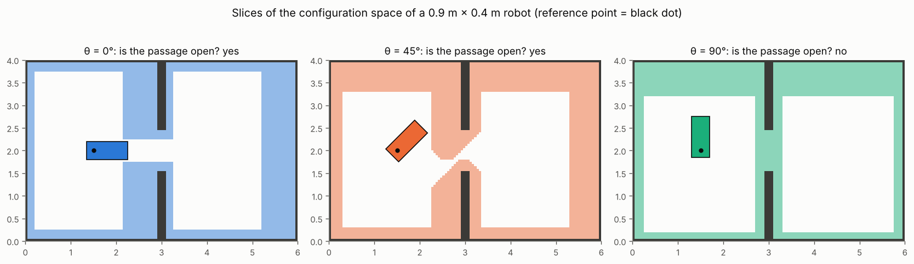
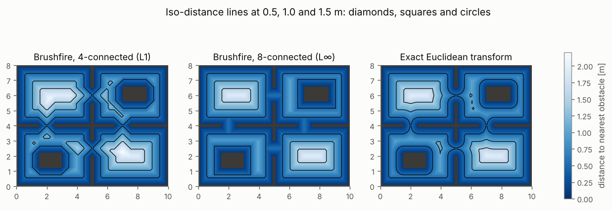
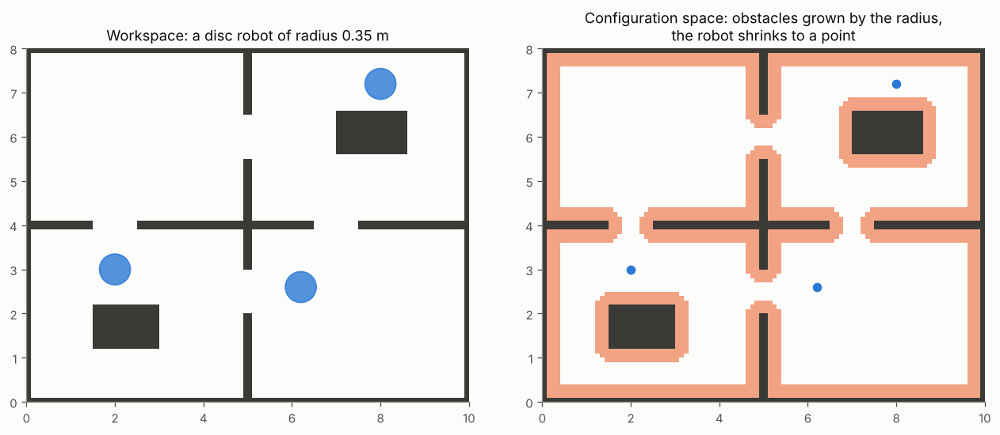
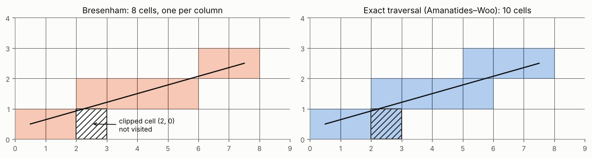

# 2 · Configuration space and occupancy grids

Chapter 1 gave the motion of a vehicle; this chapter gives the obstacles it must not hit. The central idea is
the *configuration space*: instead of asking whether a robot-shaped body overlaps an obstacle, every planner
in the following chapters asks whether a single point — the configuration — lies in a forbidden region. We build
that region on occupancy grids, compute distance transforms that every later chapter reuses (potential fields,
inflation, cost maps, clearance), and write the collision checks a planner calls millions of times.

Code: [`grid.hpp`](../cpp/include/motion_planning/grid.hpp) ·
Tests: [`test_grid.cpp`](../cpp/tests/test_grid.cpp) ·
Notebook: [`02_configuration_space.ipynb`](../2_notebooks/exercises/02_configuration_space.ipynb)

## 2.1 Workspace and configuration space

The robot moves in a *workspace* $\mathcal{W} = \mathbb{R}^2$ that contains obstacles $\mathcal{O} \subset \mathcal{W}$.
Its configuration $q$ (chapter 1: $q = (x, y, \theta)$ for a planar vehicle) determines the set of workspace
points it occupies, $\mathcal{A}(q) \subset \mathcal{W}$. The configuration space $\mathcal{C}$ is the set of all
configurations; it splits into

$$
\mathcal{C}_\text{free} = \{\, q \in \mathcal{C} : \mathcal{A}(q) \cap \mathcal{O} = \emptyset \,\},
\tag{2.1}
$$

$$
\mathcal{C}_\text{obs} = \{\, q \in \mathcal{C} : \mathcal{A}(q) \cap \mathcal{O} \neq \emptyset \,\}.
\tag{2.2}
$$

A *path* is a continuous curve $\tau : [0, 1] \to \mathcal{C}$; it is collision-free if $\tau(s) \in
\mathcal{C}_\text{free}$ for all $s$. Planning for a body has become planning for a point; the cost is that
$\mathcal{C}$ may have more dimensions than $\mathcal{W}$ (three for a planar vehicle) and that the shape of
$\mathcal{C}_\text{obs}$ must be computed.

**Translating robots.** If the robot only translates, $\mathcal{A}(q) = \mathcal{A}_0 + q$ for a fixed shape
$\mathcal{A}_0$ placed at the reference point, and $q \in \mathcal{C}_\text{obs}$ iff $o = a + q$ for some
$o \in \mathcal{O}$, $a \in \mathcal{A}_0$, i.e. $q = o - a$:

$$
\mathcal{C}_\text{obs} = \mathcal{O} \oplus (-\mathcal{A}_0) = \{\, o - a : o \in \mathcal{O},\ a \in \mathcal{A}_0 \,\},
\tag{2.3}
$$

the Minkowski sum of the obstacles with the robot reflected through its reference point. For a disc of radius
$r$ centred on the reference point, $-\mathcal{A}_0 = \mathcal{A}_0$ and

$$
\mathcal{C}_\text{obs} = \{\, p : d(p, \mathcal{O}) \le r \,\},
\tag{2.4}
$$

the obstacles *grown* by $r$. A disc robot never needs a heading in $\mathcal{C}$: rotating a disc changes
nothing.

**Rotating robots.** For a rectangle (a car, a pallet truck) $\mathcal{A}(q)$ depends on $\theta$, and
$\mathcal{C}_\text{obs}$ is a stack of slices, each the Minkowski sum (2.3) of the obstacles with the robot
rotated by $\theta$. A gap that the robot passes lengthwise may be closed sideways.

*Three slices of $\mathcal{C}_\text{obs}$ for a rectangular robot, with the reference point near its rear. The
0.9 m gap is open to the robot facing it and closed to the robot turned by $90^\circ$. Figure:
`tools/figures/fig_02_configuration_space.py`.*

## 2.2 Occupancy grids

An occupancy grid divides a rectangle of the workspace into square cells of side $h$ (the resolution) and stores
one bit per cell: occupied or free. With the map origin $(x_0, y_0)$ at the lower-left corner, the point
$(x, y)$ lies in cell

$$
(i, j) = \left( \left\lfloor \frac{x - x_0}{h} \right\rfloor,\ \left\lfloor \frac{y - y_0}{h} \right\rfloor \right),
\qquad \text{centre } \big(x_0 + (i + \tfrac12)h,\ y_0 + (j + \tfrac12)h\big).
\tag{2.5}
$$

In code and in NumPy, the occupancy array is indexed `[j, i]` (row = $y$, column = $x$) and plotted with
`origin="lower"`. Everything outside the map counts as occupied, so no planner can leave it.

Grids are what range sensors build (chapter 8 and every SLAM system produce them), and they make collision
tests $O(1)$ lookups. Their weakness is resolution: an obstacle smaller than a cell, or a gap narrower than a
cell, may vanish or close. A grid map is only as conservative as the rasterisation that produced it: here a cell
is occupied if any obstacle covers its centre (see `maps.py`), which can shave up to $h/2$ off an obstacle.
Planners on grids are *resolution complete*: they find a path if one exists *at that resolution*.

## 2.3 Distance transforms

A distance transform labels every cell with the distance to the nearest occupied cell. It gives the
configuration space of a disc robot by thresholding (2.4), the repulsive potentials of chapter 3, the clearance
costs of chapters 4 and 8, and the most useful single collision test there is.

**Brushfire.** Start a wave on all occupied cells at distance 0 and let it spread one neighbour per step:

$$
d(c) = 0 \text{ for } c \in \mathcal{O}, \qquad d(c) = 1 + \min_{n \in N(c)} d(n) \text{ otherwise}.
\tag{2.6}
$$

A breadth-first queue labels each cell the first time the wave reaches it, which is with the fewest steps. With
4-neighbours the step count is the Manhattan ($L_1$) distance, with 8-neighbours the Chebyshev ($L_\infty$)
distance, both in cells. Brushfire is linear in the number of cells and simple, but its iso-distance curves are
diamonds or squares, not circles: the $L_1$ distance overestimates a diagonal Euclidean distance by up to
$\sqrt 2$, the $L_\infty$ distance underestimates it by the same factor.

**Exact Euclidean transform.** We want $D(p) = \min_{q \in \mathcal{O}} \lVert p - q \rVert^2$ over cell centres.
Writing $p = (x, y)$, $q = (x', y')$ and $f(x', y') = 0$ on occupied cells, $+\infty$ elsewhere:

$$
D(x, y) = \min_{x'} \left[ (x - x')^2 + \min_{y'} \big( (y - y')^2 + f(x', y') \big) \right].
\tag{2.7}
$$

The inner minimum is a one-dimensional transform along each column; the outer one is the same transform along
each row of the result. So everything reduces to the 1-D problem

$$
d(p) = \min_{q} \big( (p - q)^2 + f(q) \big), \qquad p, q \in \{0, \dots, n-1\}.
\tag{2.8}
$$

Each $q$ contributes a parabola $(p - q)^2 + f(q)$ rooted at $(q, f(q))$, and $d$ is their *lower envelope*. All
parabolas have the same shape, so two of them cross exactly once, at

$$
s = \frac{\big(f(q) + q^2\big) - \big(f(r) + r^2\big)}{2q - 2r},
\tag{2.9}
$$

and to the right of $s$ the one rooted further right is lower. Sweeping $q$ left to right, the
Felzenszwalb–Huttenlocher algorithm keeps the envelope as a stack of parabolas $v_0, \dots, v_k$ with boundaries
$z_0 = -\infty < z_1 < \dots < z_{k+1} = +\infty$:

1. For each $q$ with $f(q) < \infty$: compute $s$ (2.9) with the top parabola $v_k$. While $s \le z_k$, the top
   parabola is nowhere lowest — pop it and recompute $s$ with the new top. Push $q$ with boundary $z_{k} = s$.
2. Sweep $p = 0, \dots, n-1$, advancing $k$ while $z_{k+1} < p$, and set $d(p) = (p - v_k)^2 + f(v_k)$.

Each parabola is pushed and popped at most once, so the 1-D pass is $O(n)$ and the 2-D transform is linear in the
number of cells, like brushfire, but exact. Multiplying $\sqrt{D}$ by $h$ gives metres.

*The same map under the three distance functions. Only the exact transform has round iso-distance lines.*

**Worked example.** A $5 \times 3$ grid with occupied cells $(0, 0)$ and $(4, 2)$. For the centre cell $(2, 1)$:
4-connected brushfire 3, 8-connected brushfire 2, Euclidean $\sqrt{2^2 + 1^2} = \sqrt5$ (both obstacles are at
that distance). For cell $(4, 0)$: Euclidean 2, brushfire 2. (Checked in `test_grid.cpp`.)

## 2.4 Inflation and the disc test

**Inflation.** By (2.4), the configuration space of a disc robot of radius $r$ on a grid is obtained by marking
every cell within $r$ of an occupied cell:

$$
c \in \mathcal{C}_\text{obs} \iff h\sqrt{D(c)} \le r .
\tag{2.10}
$$

Planners for differential-drive robots usually run on the inflated grid and treat the robot as a point.
Equation (2.10) is exact at cell centres only: a position elsewhere in a free cell may be up to $\sqrt2 h$ closer
to an obstacle (see (2.11) below), so a robot that must be safe at every continuous position is inflated by
$r + \sqrt2 h$.

**Disc test from the transform.** To test a disc at an arbitrary point $p$ (not a cell centre), look up $D$ at
$p$'s cell $c$. The point is at most $h/\sqrt2$ from $c$'s centre, and an occupied cell extends $h/\sqrt2$ from
its own centre, so the true clearance of $p$ is at least $h\sqrt{D(c)} - \sqrt2 h$, and

$$
h\sqrt{D(c)} - \sqrt2\, h > r \implies \text{the disc of radius } r \text{ at } p \text{ is free.}
\tag{2.11}
$$

The test is conservative: it may reject a free disc within $\sqrt2 h$ of an obstacle, never accept a colliding
one. A car can be covered by a few discs along its axis, each tested with (2.11).

## 2.5 Collision checking

A planner checks two things: configurations (is $q \in \mathcal{C}_\text{free}$?) and motions (is the whole
segment from $q_a$ to $q_b$ free?).

**Points and footprints.** A point robot is one grid lookup. A rectangular footprint at pose $q$ is tested
against every occupied cell under its bounding box with the *separating-axis theorem*: two convex polygons are
disjoint iff there is a line, parallel to one of their edges' normals, onto which their projections do not
overlap. For a rectangle with axes $\mathbf f = (\cos\theta, \sin\theta)$, $\mathbf l = (-\sin\theta, \cos\theta)$
and an axis-aligned cell, four axes suffice:

$$
\text{disjoint} \iff \exists\, \mathbf a \in \{\mathbf e_x, \mathbf e_y, \mathbf f, \mathbf l\} :\;
\max_{\text{rect}} \mathbf a^\top p < \min_{\text{cell}} \mathbf a^\top p \;\;\text{or}\;\;
\max_{\text{cell}} \mathbf a^\top p < \min_{\text{rect}} \mathbf a^\top p .
\tag{2.12}
$$

`configuration_space_slice` applies (2.12) with the reference point at every cell centre: that is how the slices
above were computed.

**Segments.** Sampling points along a segment at some step misses walls thinner than the step. The exact answer
is the set of cells whose interior the segment passes through. Parametrise the segment as
$p(t) = p_0 + t(p_1 - p_0)$, $t \in [0, 1]$, in cell units. Let $t^x_\text{max}$ be the value of $t$ at which it
next crosses a vertical grid line and $t^x_\Delta = 1/\lvert x_1 - x_0 \rvert$ the change in $t$ between two
vertical lines; likewise for $y$. Then (Amanatides and Woo):

1. Start in the cell of $p_0$.
2. Repeat $\lvert i_1 - i_0 \rvert + \lvert j_1 - j_0 \rvert$ times: if $t^x_\text{max} < t^y_\text{max}$, step one
   cell in $x$ and add $t^x_\Delta$ to $t^x_\text{max}$; otherwise step in $y$ and add $t^y_\Delta$ to
   $t^y_\text{max}$. Record the cell.

Every step crosses exactly one grid line, so consecutive cells share an edge and no cell the segment enters is
skipped. Bresenham's line algorithm, made for drawing, takes one cell per column instead and skips the cells
the line only clips.

**Worked example.** From the centre of cell $(0, 0)$ to the centre of $(7, 2)$ the segment crosses $y = 1$ at
$x = 2.25$. Bresenham visits 8 cells, the exact traversal 10; Bresenham never visits cell $(2, 0)$, which the
segment clips, so an obstacle there is invisible to it. (Checked in `test_grid.cpp`.)

## 2.6 Algorithm summary

To prepare a grid for planning a disc robot of radius $r$:

1. Build or load the occupancy grid; check the resolution resolves the narrowest gap that matters.
2. Compute the Euclidean distance transform (2.7)–(2.9) once.
3. Inflate by $r$ (2.10) for point-robot planners; keep the transform for clearance costs and (2.11).
4. Check motions with the exact traversal; check rectangular footprints with (2.12) or with discs.

## Common mistakes

- **Swapping rows and columns.** `grid[y, x]`, not `grid[x, y]`; plot with `origin="lower"`. A transposed map
  looks plausible and gives nonsense paths.
- **Sampling a segment.** A fixed sampling step misses obstacles thinner than the step; Bresenham misses clipped
  corners. Traverse the cells exactly.
- **Inflating by the wrong radius.** A rectangle needs the radius of its *circumscribed* circle (measured from the
  reference point) to be safe; the inscribed radius lets corners hit walls. The circumscribed disc is safe but can
  close passages the robot could pass lengthwise; then plan in $(x, y, \theta)$ with footprint checks.
- **Brushfire distances as metres.** They are $L_1$ or $L_\infty$ step counts; multiply by $h$, and remember the
  $\sqrt2$ error on diagonals.
- **Too coarse a grid.** Rasterising by cell centres can shave up to $h/2$ off each side of a gap, so a coarse
  grid can report a passage open that the robot cannot pass (or close one it can). Gaps that matter must be
  several cells wide.
- **Forgetting the map border.** Out-of-map cells must count as occupied, or planners leave the map.

## References

- T. Lozano-Pérez, "Spatial planning: a configuration space approach", *IEEE Transactions on Computers* C-32(2),
  1983 — the configuration space and Minkowski-sum obstacles.
- S. M. LaValle, *Planning Algorithms*, Cambridge University Press, 2006 — ch. 4 (the configuration space) and §5.3
  (collision detection).
- H. Choset, K. M. Lynch, S. Hutchinson, G. Kantor, W. Burgard, L. E. Kavraki, S. Thrun, *Principles of Robot
  Motion*, MIT Press, 2005 — ch. 3 (configuration space) and ch. 4 (brushfire and the wave-front).
- S. Thrun, W. Burgard, D. Fox, *Probabilistic Robotics*, MIT Press, 2005 — ch. 9: occupancy grid mapping.
- P. F. Felzenszwalb, D. P. Huttenlocher, "Distance transforms of sampled functions", *Theory of Computing* 8,
  2012.
- J. Amanatides, A. Woo, "A fast voxel traversal algorithm for ray tracing", *Eurographics*, 1987.
- J. E. Bresenham, "Algorithm for computer control of a digital plotter", *IBM Systems Journal* 4(1), 1965.
- S. Gottschalk, M. C. Lin, D. Manocha, "OBBTree: a hierarchical structure for rapid interference detection",
  *SIGGRAPH*, 1996 — the separating-axis test.
