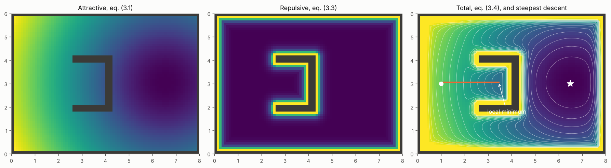
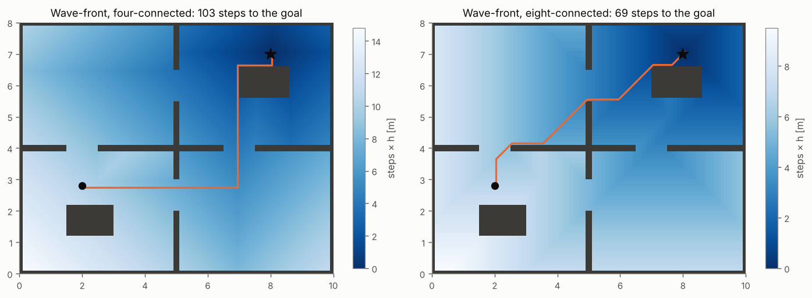

# 3 · Potential fields

The oldest idea in reactive navigation: make the goal attract the robot and the obstacles repel it, and let the
robot roll downhill. It is cheap, needs only local information and produces smooth motion — and it fails in a
way every robotics engineer should be able to predict: local minima. This chapter derives the classical
attractive and repulsive potentials, runs gradient descent on them, shows exactly where it gets stuck, and then
removes the local minima with the wave-front planner, a potential computed by search.

Code: [`potential.hpp`](../cpp/include/motion_planning/potential.hpp) ·
Tests: [`test_potential.cpp`](../cpp/tests/test_potential.cpp) ·
Notebook: [`03_potential_fields.ipynb`](../2_notebooks/exercises/03_potential_fields.ipynb)

## 3.1 Attractive potential

We want a function $U_\text{att}(q)$ with its only minimum at the goal $q_g$ and a gradient that points away from
it. The quadratic $\tfrac12\zeta\lVert q - q_g\rVert^2$ is the obvious choice, but its gradient grows without
bound with the distance, which makes the robot rush when far away. The standard fix is to switch to a cone
beyond a distance $d^*$, matching value and slope at the switch:

$$
U_\text{att}(q) =
\begin{cases}
\tfrac12 \zeta\, d(q)^2, & d(q) \le d^*, \\[2pt]
d^* \zeta\, d(q) - \tfrac12 \zeta\, (d^*)^2, & d(q) > d^*,
\end{cases}
\qquad d(q) = \lVert q - q_g \rVert .
\tag{3.1}
$$

Both pieces are $\tfrac12\zeta (d^*)^2$ at $d = d^*$, and differentiating ($\nabla d = (q - q_g)/d$):

$$
\nabla U_\text{att}(q) =
\begin{cases}
\zeta\, (q - q_g), & d(q) \le d^*, \\[2pt]
d^* \zeta\, \dfrac{q - q_g}{d(q)}, & d(q) > d^*,
\end{cases}
\tag{3.2}
$$

continuous at $d^*$, with constant magnitude $\zeta d^*$ on the cone.

## 3.2 Repulsive potential

Let $D(q)$ be the distance from $q$ to the nearest obstacle — exactly the distance transform of chapter 2. An
obstacle should push only when the robot is near it, within an influence distance $Q^*$, and the push should
become infinite on contact:

$$
U_\text{rep}(q) =
\begin{cases}
\tfrac12 \eta \left( \dfrac{1}{D(q)} - \dfrac{1}{Q^*} \right)^2, & D(q) \le Q^*, \\[6pt]
0, & D(q) > Q^* .
\end{cases}
\tag{3.3}
$$

$U_\text{rep}$ and its gradient vanish at $D = Q^*$, so the field is continuously differentiable. With
$\nabla(1/D) = -\nabla D / D^2$,

$$
\nabla U_\text{rep}(q) = \eta \left( \frac{1}{Q^*} - \frac{1}{D(q)} \right) \frac{\nabla D(q)}{D(q)^2},
$$

which points towards the obstacle (since $1/Q^* < 1/D$ and $\nabla D$ points away from it), so the descent
direction $-\nabla U_\text{rep}$ points away. Using the distance transform for $D$ handles any obstacle shape at
once; a separate potential per obstacle, as in the original papers, makes the repulsion of two nearby obstacles
add up and close gaps.

The total potential is

$$
U(q) = U_\text{att}(q) + U_\text{rep}(q).
\tag{3.4}
$$

## 3.3 Gradient descent

The robot follows the negative gradient:

$$
q_{k+1} = q_k - \alpha_k \nabla U(q_k), \qquad \text{stop when } \lVert \nabla U(q_k) \rVert < \epsilon .
\tag{3.5}
$$

On a grid the analogue needs no step size: move to the neighbour with the lowest potential.

**Algorithm (discrete steepest descent).**

1. Start at the cell of $q_\text{start}$.
2. Among the 4 or 8 neighbours, find the one with the lowest $U$.
3. If it is strictly lower than the current cell, move there and repeat from 2.
4. Otherwise stop: the current cell is the goal or a local minimum.

$U$ strictly decreases with every move and the grid is finite, so the descent always terminates — but nothing
says it terminates at the goal.

## 3.4 Local minima

A descent stops where $\nabla U = 0$, i.e. where $\nabla U_\text{att} = -\nabla U_\text{rep}$: the obstacle pushes
back exactly as hard as the goal pulls. Behind a U-shaped obstacle that faces the start, the attraction drives
the robot into the U and the repulsion of its back wall stops it there. The point is a true minimum of $U$: every
direction is uphill, so no amount of tuning $\zeta$, $\eta$ or $Q^*$ removes it without changing the obstacle.

*Attractive, repulsive and total potential around a U-shaped obstacle; the descent from the white dot ends in a
local minimum inside the U, the goal is the star. Figure: `tools/figures/fig_03_potential_fields.py`.*

Two less obvious failures come from the gains rather than the geometry:

- **Closed doors.** If $Q^*$ is more than half a door's width, the repulsion of both door frames overlaps in the
  doorway and can outweigh the attraction: the descent stops in front of an open door.
- **Displaced goal.** If the goal is within $Q^*$ of an obstacle, $U_\text{rep}$ is not zero there and the
  minimum of $U$ moves away from $q_g$; the robot stops near, not at, the goal.

In a building, with walls between start and goal, a potential field alone almost always gets stuck. Potential
fields are local planners: chapter 8 uses one as a short-horizon controller behind a global planner.

Navigation functions (Rimon and Koditschek) are potentials built to have a single minimum on special
"sphere worlds"; on a grid there is a much simpler construction.

## 3.5 The wave-front planner

Replace the attractive potential by the *number of steps to the goal through free space*. Start a wave at the
goal and let it spread through free cells only:

$$
w(q_g) = 0, \qquad w(c) = 1 + \min_{n \in N(c),\ n \text{ free}} w(n) \text{ for free } c \ne q_g,
\qquad w = \infty \text{ on obstacles}.
\tag{3.6}
$$

This is brushfire (chapter 2) started from the goal instead of the obstacles, and blocked by them. A
breadth-first queue labels every reachable free cell with its distance in steps.

**No local minima.** Every reachable cell $c \neq q_g$ was labelled $w(c) = k$ from a neighbour labelled
$k - 1$ (the cell that put it in the queue). So every cell except the goal has a strictly lower neighbour, and the
discrete descent can only stop at the goal. Descending $w$ from any reachable cell reaches the goal in exactly
$w(c)$ steps, which is the length of a shortest grid path. Cells with $w = \infty$ are unreachable: the planner
also *proves* that no path exists, at that resolution.

**Worked example.** A $4 \times 3$ grid, goal at $(0, 0)$, cells $(1, 1)$ and $(2, 1)$ occupied, 4-connected:

| $y = 2$ | 2 | 3 | 4 | 5 |
|---|---|---|---|---|
| $y = 1$ | 1 | ∞ | ∞ | 4 |
| $y = 0$ | **0** | 1 | 2 | 3 |

Cell $(3, 2)$ is 5 steps away by either route. (Checked in `test_potential.cpp`.)

The price of the wave-front is that it is global: it needs the whole map and a pass over all of it, which
potential fields avoid. And its paths are shortest in *steps*, so they hug obstacles and corners; plan on the
inflated grid of chapter 2, or add a clearance cost (chapter 4). With 8-connectivity a diagonal step costs the
same as a straight one, so paths are shortest in the $L_\infty$ sense, not in length; chapter 4 fixes this with
Dijkstra's algorithm and true step costs.

*Wave-front potential and descent paths in the rooms map. Both reach the goal; both graze the walls.*

## Common mistakes

- **Expecting tuning to remove a local minimum.** A minimum caused by geometry survives every choice of gains.
- **One repulsive potential per obstacle, summed.** Neighbouring obstacles add up and close gaps that the
  distance-transform potential leaves open.
- **$Q^*$ wider than half a passage.** The passage closes.
- **Descending with a fixed step on the continuous field.** Too large a step jumps over thin obstacles or oscillates
  across a valley; on grids, the discrete descent avoids the step size altogether.
- **Treating "stopped" as "arrived".** Always check whether the descent ended at the goal.
- **Wave-front paths straight into a robot.** They have zero clearance; inflate first.

## References

- O. Khatib, "Real-time obstacle avoidance for manipulators and mobile robots", *International Journal of
  Robotics Research* 5(1), 1986.
- H. Choset, K. M. Lynch, S. Hutchinson, G. Kantor, W. Burgard, L. E. Kavraki, S. Thrun, *Principles of Robot
  Motion*, MIT Press, 2005 — ch. 4: attractive/repulsive potentials, brushfire and the wave-front planner (the
  forms (3.1) and (3.3) follow this book).
- J.-C. Latombe, *Robot Motion Planning*, Kluwer, 1991 — ch. 7: potential field methods.
- E. Rimon, D. E. Koditschek, "Exact robot navigation using artificial potential functions", *IEEE Transactions on
  Robotics and Automation* 8(5), 1992.
- Y. Koren, J. Borenstein, "Potential field methods and their inherent limitations for mobile robot navigation",
  *IEEE International Conference on Robotics and Automation*, 1991.
- S. S. Ge, Y. J. Cui, "New potential functions for mobile robot path planning", *IEEE Transactions on Robotics and
  Automation* 16(5), 2000 — goals non-reachable with obstacles nearby.
