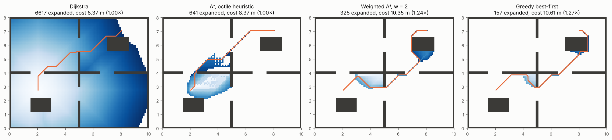
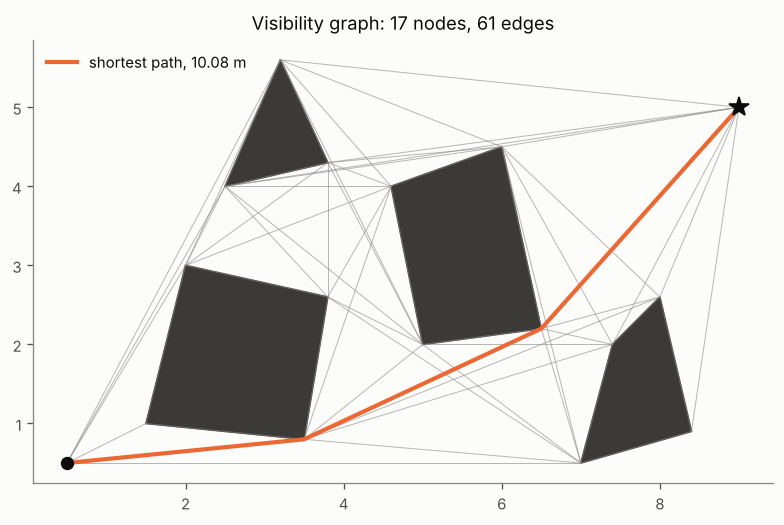

# 4 · Graph search

Chapter 3 ended with the wave-front: a breadth-first search from the goal. This chapter makes that idea
general. A map becomes a graph — a grid, a visibility graph, later a sampled roadmap — and a single algorithm
template, *best-first search*, covers breadth-first search, Dijkstra's algorithm, A* and its weighted and greedy
variants, depending only on the order in which it expands nodes. We prove when the result is optimal, how many
nodes a good heuristic saves, and what a weight trades away.

Code: [`graph_search.hpp`](../cpp/include/motion_planning/graph_search.hpp) ·
Tests: [`test_graph_search.cpp`](../cpp/tests/test_graph_search.cpp) ·
Notebook: [`04_graph_search.ipynb`](../2_notebooks/exercises/04_graph_search.ipynb)

## 4.1 Graphs and costs

A graph $G = (V, E)$ has nodes $V$ and directed edges $E$ with non-negative costs $c(u, v)$. A path
$\pi = (v_0, \dots, v_k)$ costs $c(\pi) = \sum_i c(v_i, v_{i+1})$. We look for a path from $s$ to $t$ of minimum
cost $C^*$. The algorithms below maintain, for every node $v$, the best known cost-to-come $g(v)$ (initially
$\infty$, and $g(s) = 0$) and a parent pointer. Discovering a cheaper way into $v$ through an edge $(u, v)$ is
called *relaxing* the edge:

$$
g(v) \leftarrow \min\big(g(v),\; g(u) + c(u, v)\big).
\tag{4.1}
$$

## 4.2 Breadth-first search and Dijkstra's algorithm

**Breadth-first search** expands nodes in the order they were discovered (a FIFO queue):

$$
\text{expand next: the oldest discovered node.}
\tag{4.2}
$$

It visits nodes in order of the *number of edges* from $s$, so it returns a path with the fewest edges — the
shortest path when all edges cost the same, as in the wave-front of chapter 3. With unequal costs (diagonal grid
steps cost $\sqrt2$ times more) the fewest edges is not the cheapest path.

**Dijkstra's algorithm** expands the open node with the smallest cost-to-come:

$$
f(v) = g(v).
\tag{4.3}
$$

*Why it is optimal.* Suppose $u$ is about to be expanded with $g(u) > g^*(u)$, the true optimal cost. On an
optimal path to $u$, let $x$ be the first node not yet expanded; its predecessor was expanded with its optimal
cost and relaxed the edge into $x$, so $g(x) = g^*(x) \le g^*(u) < g(u)$ (costs are non-negative). Then $x$ has
a smaller key than $u$ and would be expanded first — a contradiction. So every node is expanded with its optimal
cost, and expanded at most once.

Dijkstra explores in growing cost "circles" around $s$, in every direction alike — wasteful when we know where
the goal is.

## 4.3 Best-first search

All the algorithms of this chapter are one template with a different key $f$:

1. Set $g(s) = 0$, put $s$ in the open list with key $f(s)$; every other $g$ is $\infty$.
2. Pop the open node $u$ with the smallest key (ties: smallest $h$). If it is already closed, or was pushed with
   a $g$ larger than the current $g(u)$, discard it and pop again.
3. Close $u$. If $u = t$, stop: follow the parents back to $s$.
4. For each edge $(u, v)$ with $v$ not closed, relax it (4.1); if $g(v)$ decreased, set the parent of $v$ to $u$
   and push $v$ with its new key.
5. If the open list empties, there is no path.

Step 2 is "lazy deletion": instead of decreasing a key inside the heap, push a new entry and skip the stale one
later. With a binary heap the search costs $O(|E| \log |V|)$.

## 4.4 A* and heuristics

A* adds an estimate $h(v)$ of the remaining cost from $v$ to $t$:

$$
f(v) = g(v) + h(v),
\tag{4.4}
$$

the estimated cost of the cheapest solution through $v$. Two properties of $h$ matter. With $h^*(v)$ the true
cost-to-go,

$$
\text{admissible: } h(v) \le h^*(v), \qquad
\text{consistent: } h(u) \le c(u, v) + h(v) \text{ for every edge, and } h(t) = 0.
\tag{4.5}
$$

Consistency (the triangle inequality) implies admissibility. *Optimality with closed nodes.* If $h$ is
consistent, $f$ never decreases along a path, $f(v) = g(u) + c(u, v) + h(v) \ge g(u) + h(u) = f(u)$. Repeating the
Dijkstra argument with keys $f$ instead of $g$ shows that each node is closed with its optimal $g$, so

$$
h \text{ consistent} \implies \text{A* returns a path of cost } C^* \text{ expanding each node at most once.}
\tag{4.6}
$$

(With an admissible but inconsistent $h$, A* is still optimal if it is allowed to re-open closed nodes; our
implementation does not re-open, so it relies on consistency.) A* also never expands a node with $f > C^*$,
while Dijkstra expands every node with $g < C^*$: the better $h$, the fewer expansions. $h = 0$ gives Dijkstra
back; $h = h^*$ expands only the optimal path.

**Grid heuristics.** For a step $(\Delta x, \Delta y)$ in cells, with $M = \max(|\Delta x|, |\Delta y|)$ and
$m = \min(|\Delta x|, |\Delta y|)$, in units of the cell size:

| heuristic | formula | 4-connected | 8-connected (diagonal $\sqrt2$) |
|---|---|---|---|
| Manhattan | $\lvert\Delta x\rvert + \lvert\Delta y\rvert$ | exact on an empty grid — consistent | **overestimates** diagonals — inadmissible |
| octile | $M + (\sqrt2 - 1)\,m$ | admissible, weak | exact on an empty grid — consistent |
| Euclidean | $\sqrt{\Delta x^2 + \Delta y^2}$ | admissible, weak | consistent, weaker than octile |
| Chebyshev | $M$ | admissible, weak | consistent, weaker still |

The best heuristic is the largest consistent one: on 8-connected grids, octile.

## 4.5 Weighted A* and greedy search

Inflating the heuristic trades optimality for speed:

$$
f(v) = g(v) + w\, h(v), \quad w \ge 1; \qquad \text{greedy best-first: } f(v) = h(v).
\tag{4.7}
$$

*Bound.* Let $h$ be consistent and let the search close $t$ with $g(t)$. At that moment some node $n$ of an
optimal path is open with $g(n) = g^*(n)$ (Likhachev et al. show this survives without re-opening), so

$$
g(t) = f(t) \le f(n) = g^*(n) + w\,h(n) \le w\big(g^*(n) + h(n)\big) \le w\, C^* .
\tag{4.8}
$$

Weighted A* is *$w$-suboptimal*: never worse than $w$ times the optimum, usually much better, and it expands far
fewer nodes because it dives towards the goal. Greedy best-first ignores $g$ altogether: fast, but with no bound
on the cost at all.



*Expanded cells (darker = later) and paths in the rooms map. Dijkstra floods the map; A* expands a tenth as many
cells for the same cost; weighting the heuristic shrinks the search further and lengthens the path, within the
bound (4.8). Figure: `tools/figures/fig_04_graph_search.py`.*

## 4.6 Graphs from maps

**Grids.** Each free cell is a node; edges join 4 or 8 neighbours. A step of length $\ell \in \{h, \sqrt2 h\}$
into cell $c$ costs

$$
c = \ell\,\big(1 + \kappa(c)\big), \qquad \kappa(c) \ge 0,
\tag{4.9}
$$

where the optional cell cost $\kappa$ can penalise low clearance (computed from the distance transform of
chapter 2) or rough terrain. Since $\kappa \ge 0$, the heuristics above stay admissible. A diagonal step between
two occupied orthogonal neighbours would squeeze between touching obstacles ("corner cutting"); it is
disallowed by default.

**Worked example.** On the 4-connected grid below (unit cells), a wall at $x = 3$ forces the path up to row 3.

```
y=3  .  .  .  .  .  .
y=2  .  #  #  #  .  .
y=1  .  .  .  #  .  .
y=0  S  .  .  #  .  G
```

Any shortest path must reach $(3, 3)$ — Manhattan distance 6 from S — and then G, Manhattan distance 5 more: the
cost is 11. BFS, Dijkstra and A* with the Manhattan heuristic all return cost 11. (Checked in
`test_graph_search.cpp`.)

**Visibility graphs.** For polygonal obstacles in the plane, the shortest path from $s$ to $t$ is a polyline
whose interior vertices are obstacle vertices: wherever the path bends at a point that is not a vertex it could
be shortened. So the shortest path lies in the *visibility graph*: nodes $s$, $t$ and all obstacle vertices,
edges between every pair that "see" each other (the segment does not enter any obstacle's interior). Built
naively by testing every pair against every edge it costs $O(n^3)$; A* with the Euclidean heuristic then finds the
exact shortest path. The price: the path touches the obstacles; grow them first (chapter 2) for a robot with a
size.



*Visibility graph and shortest path. Segment test: reject proper crossings with any obstacle edge, then split
the segment at obstacle vertices lying on it and check that no piece's midpoint is inside an obstacle.*

## Common mistakes

- **BFS on weighted graphs.** Fewest edges is not least cost once diagonal steps cost $\sqrt2$.
- **Manhattan on an 8-connected grid.** Inadmissible: A* returns paths that are not shortest.
- **Stopping when the goal is *discovered*.** The first discovery need not be the cheapest; stop when the goal is
  *expanded* (popped).
- **Forgetting stale heap entries.** With lazy deletion, skip entries whose node is closed or whose $g$ is outdated;
  otherwise nodes are expanded twice.
- **Inconsistent heuristics without re-opening.** The closed list then locks in suboptimal costs.
- **Comparing algorithms by run time on one map.** Count expanded nodes; ties and heap details move timings around.

## References

- E. W. Dijkstra, "A note on two problems in connexion with graphs", *Numerische Mathematik* 1, 1959.
- P. E. Hart, N. J. Nilsson, B. Raphael, "A formal basis for the heuristic determination of minimum cost paths",
  *IEEE Transactions on Systems Science and Cybernetics* 4(2), 1968.
- I. Pohl, "Heuristic search viewed as path finding in a graph", *Artificial Intelligence* 1(3), 1970 — weighted A*.
- M. Likhachev, G. Gordon, S. Thrun, "ARA*: anytime A* with provable bounds on sub-optimality", *NIPS*, 2003 — the
  bound (4.8) without re-expansions.
- S. Russell, P. Norvig, *Artificial Intelligence: A Modern Approach*, 4th ed., Pearson, 2020 — ch. 3: uninformed
  and informed search, admissibility and consistency.
- S. M. LaValle, *Planning Algorithms*, Cambridge University Press, 2006 — §2.2 (discrete search) and §6.2.4 (the
  shortest-path roadmap, i.e. the visibility graph).
- M. de Berg, O. Cheong, M. van Kreveld, M. Overmars, *Computational Geometry: Algorithms and Applications*, 3rd
  ed., Springer, 2008 — ch. 15: visibility graphs.
- T. H. Cormen, C. E. Leiserson, R. L. Rivest, C. Stein, *Introduction to Algorithms*, 3rd ed., MIT Press, 2009 —
  ch. 22–24: BFS and Dijkstra.
