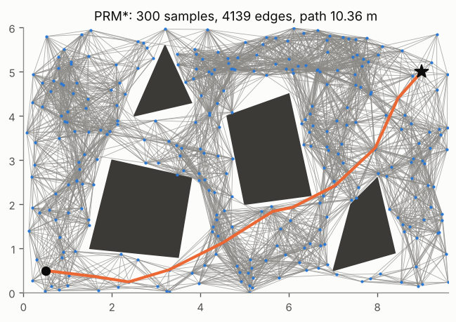
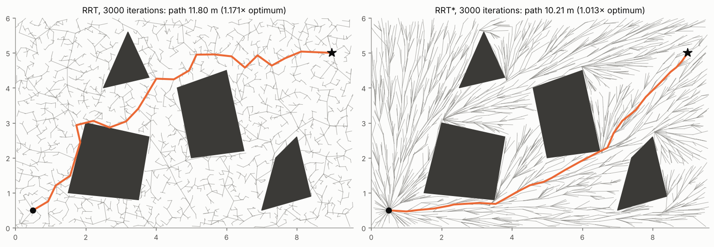
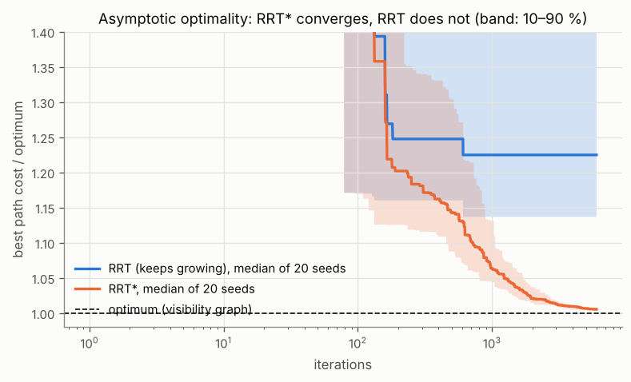

# 5 · Sampling-based planning

Grids discretise the whole configuration space, and their size grows as $k^d$ with the dimension $d$: fine for a
planar robot, hopeless for a 7-joint arm. Sampling-based planners never build $\mathcal{C}_\text{free}$
explicitly. They only ask two questions of a collision checker — is this configuration free? is this straight
motion free? — and connect random samples into a graph or a tree. This chapter covers the probabilistic roadmap
(PRM), the rapidly-exploring random tree (RRT) and RRT*, the variant that converges to the optimal path, and what
"probabilistically complete" and "asymptotically optimal" actually promise.

Code: [`sampling.hpp`](../cpp/include/motion_planning/sampling.hpp) ·
Tests: [`test_sampling.cpp`](../cpp/tests/test_sampling.cpp),
[`test_ompl_reference.py`](../python/tests/test_ompl_reference.py) ·
Notebook: [`05_sampling_planning.ipynb`](../2_notebooks/exercises/05_sampling_planning.ipynb)

## 5.1 The setting

A planning problem consists of a bounded configuration space $\mathcal{C}$ (here a rectangle in the plane),
a start $q_s$, a goal $q_g$ (or a goal region), and two oracles:

- `state_valid(q)` — is $q \in \mathcal{C}_\text{free}$? (chapter 2: a grid lookup or a polygon test);
- `motion_valid(q_a, q_b)` — is the straight segment between them in $\mathcal{C}_\text{free}$? (chapter 2: exact
  cell traversal; chapter 4: the polygon segment test).

The planners are independent of how the oracles work, which is why the same code plans for a point among
polygons, on an occupancy grid, or — with a different state space — for an arm. Collision checking dominates the
run time, so the algorithms are judged by how many checks they need.

**Steering.** Trees grow towards samples in steps of at most $\eta$:

$$
\operatorname{steer}(q_\text{near}, q_\text{rand}) = q_\text{near} + \min\!\big(\eta,\ \lVert q_\text{rand} -
q_\text{near}\rVert\big)\, \frac{q_\text{rand} - q_\text{near}}{\lVert q_\text{rand} - q_\text{near}\rVert}.
\tag{5.1}
$$

## 5.2 Probabilistic roadmaps

**Algorithm (PRM).**

1. Sample $n$ configurations uniformly; keep the valid ones as nodes. Add $q_s$ and $q_g$ as nodes.
2. For every pair of nodes closer than a radius $r$, add an edge if `motion_valid` holds.
3. Answer a query with A* on the roadmap (chapter 4).

The roadmap is built once and answers many queries: PRM is a *multi-query* planner, suited to a fixed environment
(a factory floor, a manipulator's workcell). A fixed radius $r$ makes the number of collision checks grow as
$n^2$; the PRM* radius of eq. (5.3) grows the neighbourhood just slowly enough to keep optimality while the
expected number of neighbours grows only as $\log n$.

**Probabilistic completeness.** If a path with clearance $\delta > 0$ exists, the probability that the planner
has not found one after $n$ samples decays exponentially:

$$
P(\text{failure after } n \text{ samples}) \le a\, e^{-b n},
\tag{5.2}
$$

with constants that depend on the clearance and the volume of the free space (Kavraki et al. for PRM, Kleinbort
et al. for RRT). Two consequences: a planner that has not found a path proves nothing (contrast the wave-front of
chapter 3); and *narrow passages* — regions of small clearance — make $b$ tiny, because the chance that a uniform
sample lands in a passage of width $w$ is proportional to $w$.

*A PRM* roadmap and the shortest path through it. Figure: `tools/figures/fig_05_sampling_planning.py`.*

## 5.3 Rapidly-exploring random trees

**Algorithm (RRT).**

1. The tree holds $q_s$.
2. Sample $q_\text{rand}$: with probability $p_g$ (the goal bias) the goal, otherwise uniformly.
3. Find the nearest tree node $q_\text{near}$ and steer: $q_\text{new} = \operatorname{steer}(q_\text{near},
   q_\text{rand})$ (5.1).
4. If $q_\text{new}$ and the motion $q_\text{near} \to q_\text{new}$ are valid, add $q_\text{new}$ with parent
   $q_\text{near}$.
5. If $q_\text{new}$ is within $\eta$ of the goal and the motion to it is valid, connect the goal: done (or
   continue, to look for better paths). Otherwise repeat from 2.

**Voronoi bias.** A node is extended when it is the nearest node to the sample, i.e. when the sample falls in
its Voronoi cell. Nodes on the frontier of the tree have large Voronoi cells (the unexplored space beyond them),
so the tree is pulled outwards into unexplored space — "rapidly exploring" — without any explicit notion of a
frontier. RRT is a *single-query* planner: it grows one tree for one start.

**RRT is not optimal.** The tree never revises a parent, so the first branches fix the shape of every path
through them. Karaman and Frazzoli proved that the cost of RRT's best path converges, with probability one, to a
value strictly above the optimum. More iterations do not help.

## 5.4 RRT*

RRT* changes two things in step 4, inside a ball of radius

$$
r_n = \min\!\left\{\gamma \left(\frac{\log n}{n}\right)^{1/d},\ \eta\right\}
\tag{5.3}
$$

around $q_\text{new}$, where $n$ is the number of tree nodes and $d$ the dimension. With $X_\text{near}$ the tree
nodes in that ball and $c(\cdot)$ the cost-to-come along the tree:

**Choose parent.** Connect $q_\text{new}$ to the neighbour that gives it the cheapest cost-to-come, not to the
nearest:

$$
q_\text{parent} = \arg\min_{x \in X_\text{near},\ \text{motion\_valid}(x, q_\text{new})}
\; c(x) + \lVert x - q_\text{new} \rVert .
\tag{5.5}
$$

**Rewire.** Then offer $q_\text{new}$ as a new parent to every neighbour:

$$
\text{for } x \in X_\text{near}: \quad \text{if } c(q_\text{new}) + \lVert q_\text{new} - x\rVert < c(x) \text{
and the motion is valid, set } \operatorname{parent}(x) = q_\text{new},
\tag{5.6}
$$

and lower the cost of every node below $x$ by the same amount. Rewiring is what lets early, crooked branches
straighten out as samples accumulate.

**The radius.** Karaman and Frazzoli showed that RRT* and PRM* are *asymptotically optimal* — the best cost
converges to the optimum with probability one — when $\gamma$ exceeds a threshold that depends on the free volume
$\mu(\mathcal{C}_\text{free})$ and the volume $\zeta_d$ of the unit $d$-ball:

$$
\gamma_\text{PRM*} > 2\left(1 + \tfrac1d\right)^{1/d} \left(\frac{\mu(\mathcal{C}_\text{free})}{\zeta_d}\right)^{1/d},
\qquad
\gamma_\text{RRT*} > \left(2\left(1 + \tfrac1d\right)\right)^{1/d} \left(\frac{\mu(\mathcal{C}_\text{free})}{\zeta_d}\right)^{1/d}.
\tag{5.4}
$$

The PRM* constant is the larger; the code uses it for both, with the area of the bounding box for
$\mu(\mathcal{C}_\text{free})$ — an overestimate, which is on the safe side. For $d = 2$ the PRM* bound is
$2\sqrt{1.5\,\mu/\pi}$. The ball must shrink (so the work per iteration stays $O(\log n)$ neighbours) but not too
fast (so that it keeps containing the samples that improve the path). A radius that is fixed and small makes RRT*
behave like RRT; one that is fixed and large costs $O(n)$ collision checks per iteration.

*Same samples, same budget. RRT's tree is a random scribble and its path wanders; RRT*'s rewired tree radiates from
the start like a field of shortest paths, and its path is within a few percent of optimal.*

*Best cost over iterations, relative to the exact optimum from the visibility graph of chapter 4.*

**Checking against an independent reference.** For a point among polygons the exact optimum is known (the
visibility graph, chapter 4), so the tests check that no planner ever returns a path shorter than it, and that
RRT* gets within 3 % of it. Around the square of side 2 from $(0, 0)$ to $(4, 0)$ the optimum is
$2 + 2\sqrt2 = 4.828$. A separate test runs OMPL's RRT* on the same problem and checks that both implementations
agree.

## Common mistakes

- **Reading "no path found" as "no path exists".** Sampling planners are only probabilistically complete.
- **Checking only the new state.** Every edge needs `motion_valid`; a valid endpoint says nothing about the segment.
- **Rewiring without propagating costs.** After a rewire, every descendant's cost-to-come changes; stale costs
  make later choose-parent and rewire decisions wrong.
- **A fixed RRT* radius.** Too small: no better than RRT. Too large: quadratic collision checking. Use (5.3).
- **Comparing planners on one seed.** Results are random variables; compare medians and spreads over seeds.
- **Too much goal bias.** It helps in open space and makes the tree butt against obstacles that face the goal.
- **Expecting good paths from RRT.** Its paths are feasible, not short; smooth them (chapter 7) or use RRT*.

## References

- L. E. Kavraki, P. Švestka, J.-C. Latombe, M. H. Overmars, "Probabilistic roadmaps for path planning in
  high-dimensional configuration spaces", *IEEE Transactions on Robotics and Automation* 12(4), 1996.
- S. M. LaValle, "Rapidly-exploring random trees: a new tool for path planning", Technical report TR 98-11, Iowa
  State University, 1998; S. M. LaValle, J. J. Kuffner, "Randomized kinodynamic planning", *International Journal
  of Robotics Research* 20(5), 2001.
- S. Karaman, E. Frazzoli, "Sampling-based algorithms for optimal motion planning", *International Journal of
  Robotics Research* 30(7), 2011.
- M. Kleinbort, K. Solovey, Z. Littlefield, K. E. Bekris, D. Halperin, "Probabilistic completeness of RRT for
  geometric and kinodynamic planning with forward propagation", *IEEE Robotics and Automation Letters* 4(2), 2019.
- S. M. LaValle, *Planning Algorithms*, Cambridge University Press, 2006 — ch. 5: sampling-based motion planning.
- H. Choset et al., *Principles of Robot Motion*, MIT Press, 2005 — ch. 7: sampling-based algorithms.
- I. A. Şucan, M. Moll, L. E. Kavraki, "The Open Motion Planning Library", *IEEE Robotics & Automation Magazine*
  19(4), 2012 — the reference implementation used in the tests.
