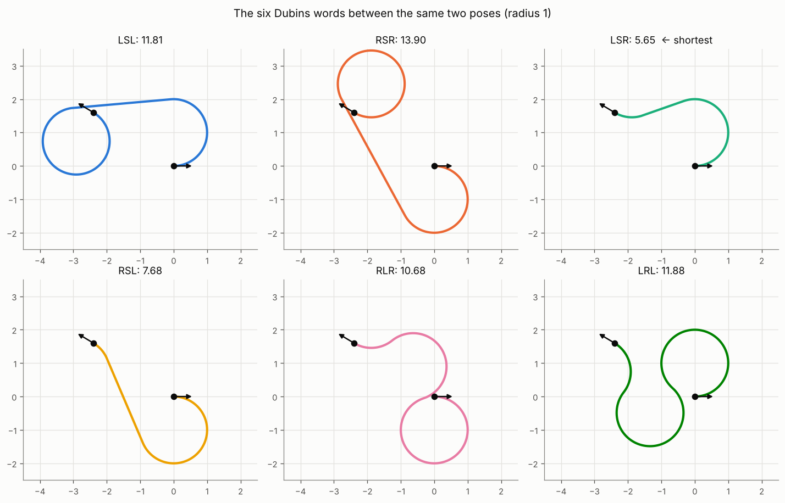
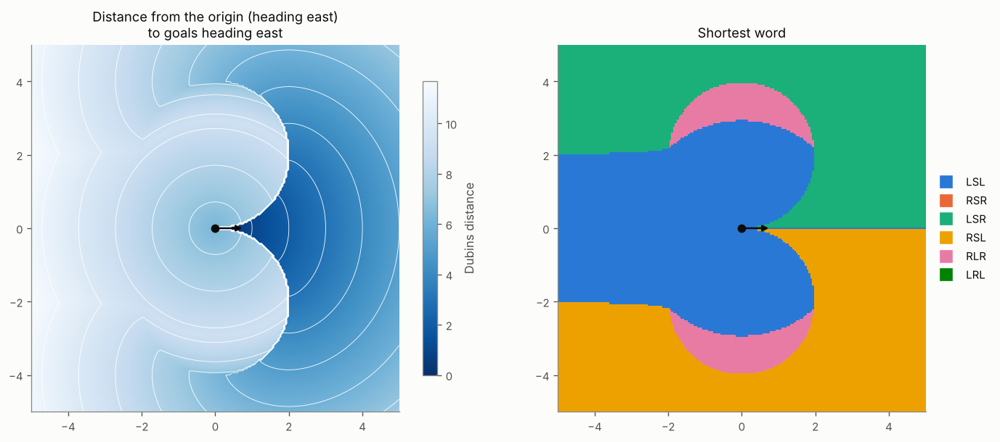
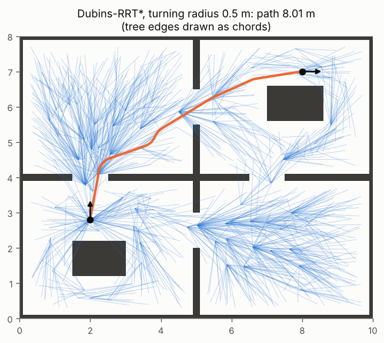

# 6 · Dubins paths

The planners of chapters 3–5 return paths for a point that can turn on the spot. A car cannot: chapter 1 showed
that the kinematic bicycle has a minimum turning radius $\rho = L / \tan\gamma_\text{max}$ and, driving forwards
only, cannot reverse its heading without a loop. This chapter finds the *shortest* path between two poses for
such a vehicle — Dubins' answer is that it is always one of six simple words of arcs and lines — and puts that
answer inside RRT* to plan among obstacles.

Code: [`dubins.hpp`](../cpp/include/motion_planning/dubins.hpp) ·
Tests: [`test_dubins.cpp`](../cpp/tests/test_dubins.cpp),
[`test_ompl_reference.py`](../python/tests/test_ompl_reference.py) ·
Notebook: [`06_dubins_paths.ipynb`](../2_notebooks/exercises/06_dubins_paths.ipynb)

## 6.1 The Dubins car

Take the rear-axle bicycle (1.7) at constant unit speed, forwards only. Its yaw rate is bounded by the steering
limit, so the model is

$$
\dot x = \cos\theta, \qquad \dot y = \sin\theta, \qquad \dot\theta = u, \qquad |u| \le \frac{1}{\rho},
\tag{6.1}
$$

and since the speed is 1, time equals arc length: a path's duration is its length. The question: among all
paths of (6.1) from $q_0$ to $q_1$, which is shortest?

**Dubins' theorem (1957).** A shortest path exists, and it consists of at most three segments, each either an
arc of radius exactly $\rho$ (a full Left or Right turn, $u = \pm 1/\rho$) or a Straight line ($u = 0$), in one of
six words:

$$
\text{CSC: } LSL,\ RSR,\ LSR,\ RSL \qquad\qquad \text{CCC: } RLR,\ LRL,
$$

with segments allowed to have zero length. So the infinite-dimensional problem reduces to evaluating six
closed-form candidates and keeping the shortest. (Pontryagin's maximum principle gives a modern proof: optimal
controls are bang–bang or singular, and bounding the number of switches leaves these six.)

## 6.2 Normalised coordinates

Translate $q_0$ to the origin, rotate so that $q_1$ lies on the positive $x$ axis, and scale lengths by $1/\rho$.
With $(\Delta x, \Delta y) = (x_1 - x_0, y_1 - y_0)$:

$$
d = \frac{\sqrt{\Delta x^2 + \Delta y^2}}{\rho}, \qquad \varphi = \operatorname{atan2}(\Delta y, \Delta x),
\qquad \alpha = (\theta_0 - \varphi) \bmod 2\pi, \qquad \beta = (\theta_1 - \varphi) \bmod 2\pi .
\tag{6.2}
$$

Now the start is $(0, 0, \alpha)$, the goal $(d, 0, \beta)$, and the radius is 1. Each word is described by its
three segment lengths $(t, p, q)$ in units of $\rho$: angles for arcs, distances for lines.

A unit circle tangent to a pose $(x, y, \theta)$ on its left has its centre at $(x - \sin\theta,\, y + \cos\theta)$;
on its right at $(x + \sin\theta,\, y - \cos\theta)$. Every formula below comes from these centres.

## 6.3 The six words

**LSL — outer tangent.** The left circles are centred at $c_0 = (-\sin\alpha, \cos\alpha)$ and
$c_1 = (d - \sin\beta, \cos\beta)$. Both turn the same way, so the straight segment is parallel to $c_1 - c_0$
and as long as it:

$$
p^2 = \lVert c_1 - c_0 \rVert^2 = 2 + d^2 - 2\cos(\alpha - \beta) + 2d(\sin\alpha - \sin\beta),
\qquad \psi = \operatorname{atan2}(\cos\beta - \cos\alpha,\ d + \sin\alpha - \sin\beta),
$$
$$
t = (\psi - \alpha) \bmod 2\pi, \qquad q = (\beta - \psi) \bmod 2\pi .
\tag{6.3}
$$

The first arc turns left from heading $\alpha$ to the line's heading $\psi$, the last from $\psi$ to $\beta$. (Expand
$\lVert c_1 - c_0\rVert^2$ with $\sin^2 + \cos^2 = 1$ and $\cos\alpha\cos\beta + \sin\alpha\sin\beta = \cos(\alpha -
\beta)$ to get $p^2$.) If $p = 0$ the two circles coincide and the path is a single arc, $t = (\beta - \alpha) \bmod
2\pi$; the code handles this case separately because $\psi$ is then $\operatorname{atan2}(0, 0)$.

**RSR** is the mirror image of LSL (reflect $y \to -y$, which maps $\alpha \to -\alpha$, $\beta \to -\beta$ and left
to right):

$$
p^2 = 2 + d^2 - 2\cos(\alpha - \beta) + 2d(\sin\beta - \sin\alpha), \quad
\psi = \operatorname{atan2}(\cos\alpha - \cos\beta,\ d - \sin\alpha + \sin\beta), \quad
t = (\alpha - \psi) \bmod 2\pi,\ q = (\psi - \beta) \bmod 2\pi .
\tag{6.4}
$$

**LSR — inner tangent.** Now $c_0 = (-\sin\alpha, \cos\alpha)$ (left) and $c_1 = (d + \sin\beta, -\cos\beta)$
(right). The line crosses between the circles. Their centres are $D$ apart with
$D^2 = d^2 + 2 + 2\cos(\alpha - \beta) + 2d(\sin\alpha + \sin\beta)$, and the inner tangent of two unit circles
has length $p = \sqrt{D^2 - 4}$, which exists only if $D \ge 2$. The line's heading is the centre line's heading
turned by $\arctan(2/p)$:

$$
p^2 = -2 + d^2 + 2\cos(\alpha - \beta) + 2d(\sin\alpha + \sin\beta), \quad
\psi = \operatorname{atan2}(-\cos\alpha - \cos\beta,\ d + \sin\alpha + \sin\beta) - \operatorname{atan2}(-2, p),
$$
$$
t = (\psi - \alpha) \bmod 2\pi, \qquad q = (\psi - \beta) \bmod 2\pi .
\tag{6.5}
$$

**RSL** is its mirror image:

$$
p^2 = -2 + d^2 + 2\cos(\alpha - \beta) - 2d(\sin\alpha + \sin\beta), \quad
\psi = \operatorname{atan2}(\cos\alpha + \cos\beta,\ d - \sin\alpha - \sin\beta) - \operatorname{atan2}(2, p),
\quad t = (\alpha - \psi) \bmod 2\pi,\ q = (\beta - \psi) \bmod 2\pi .
\tag{6.6}
$$

**RLR — three arcs.** The right circles $c_0 = (\sin\alpha, -\cos\alpha)$ and $c_1 = (d + \sin\beta, -\cos\beta)$
are joined by a left circle tangent to both, whose centre is at distance 2 from each. The triangle of centres has
sides $2, 2, D$ with $D^2 = 2 + d^2 - 2\cos(\alpha - \beta) + 2d(\sin\beta - \sin\alpha)$; the law of cosines gives
its angle $\vartheta$ at the middle centre, $D^2 = 8 - 8\cos\vartheta$, and the middle arc is the long way round,
$p = 2\pi - \vartheta$:

$$
\cos\vartheta = \frac{6 - d^2 + 2\cos(\alpha - \beta) + 2d(\sin\alpha - \sin\beta)}{8}, \quad
p = (2\pi - \arccos(\cdot)) \bmod 2\pi, \quad
t = \big(\alpha - \operatorname{atan2}(\cos\alpha - \cos\beta,\ d - \sin\alpha + \sin\beta) + \tfrac{p}{2}\big) \bmod 2\pi,
$$
$$
q = (\alpha - \beta - t + p) \bmod 2\pi,
\tag{6.7}
$$

where $q$ follows from the total heading change, $-t + p - q \equiv \beta - \alpha$. The word exists only if
$|\cos\vartheta| \le 1$, i.e. $D \le 4$: CCC words matter only for nearby poses.

**LRL** is the mirror image:

$$
\cos\vartheta = \frac{6 - d^2 + 2\cos(\alpha - \beta) + 2d(\sin\beta - \sin\alpha)}{8}, \quad
t = \big(-\alpha - \operatorname{atan2}(\cos\alpha - \cos\beta,\ d + \sin\alpha - \sin\beta) + \tfrac{p}{2}\big) \bmod 2\pi,
\quad q = (\beta - \alpha - t + p) \bmod 2\pi .
\tag{6.8}
$$

Multiplying $(t, p, q)$ by $\rho$ gives lengths in metres. To *follow* a word, drive each segment with the exact
unicycle flow (1.16) at unit speed and $\omega \in \{1/\rho, 0, -1/\rho\}$; the tests do exactly this for thousands
of random pose pairs and check that every word lands on $q_1$.

*All six words between the same pair of poses; only one is shortest. Figure:
`tools/figures/fig_06_dubins_paths.py`.*

**Worked examples** (radius $\rho$, checked in `test_dubins.cpp`): straight ahead by 5, length 5; a quarter turn
to $(\rho, \rho, \pi/2)$, length $\pi\rho/2$; a U-turn onto the parallel lane $2\rho$ to the left, $(0, 2\rho, \pi)$,
length $\pi\rho$; but turning to face backwards *on the spot*, $(0, 0, \pi)$, costs more than $\pi\rho$ — a loop.

**The Dubins distance is strange.** It is not symmetric ($d(q_0, q_1) \ne d(q_1, q_0)$: driving forwards, the way
there and the way back differ), and it is not continuous: a goal just ahead and slightly to the side, with the
same heading, is reached by a short S-bend, but one just behind needs a full loop. The left panel below shows the
jump. Planners must therefore measure "nearest" *from* the tree *to* the sample, never the other way round.

*Distance and shortest word from the origin to goals that keep its heading. Exact ties (LSL against RSR when both
loop around, RLR against LRL) are broken by word order.*

## 6.4 Dubins-RRT*

RRT* (chapter 5) needs a steering function and a cost; for a car both come from Dubins. The state is
$(x, y, \theta)$; the edge from $q_a$ to $q_b$ is the shortest Dubins path, its cost that path's length.

**Collision checking along curves.** An arc is checked as a polyline: sample poses every $\ell$ metres, check each
point, and check each chord with the exact segment test of chapter 2. A chord of an arc of radius $\rho$ and length
$\ell$ deviates from the arc by its sagitta

$$
s = \rho\left(1 - \cos\frac{\ell}{2\rho}\right) \le \frac{\ell^2}{8\rho},
\tag{6.9}
$$

so $\ell = 0.05$ m and $\rho = 0.5$ m keep the error below $0.7$ mm — far below a grid cell.

**Algorithm (Dubins-RRT*).**

1. Sample a pose (goal with probability $p_g$) whose position is free.
2. Nearest node: the smallest Dubins distance *from* a tree node to the sample.
3. Steer: the shortest Dubins path from it, cut after $\eta$ metres; reject it if it collides.
4. Neighbours: tree nodes within
   $$
   r_n = \min\left\{\gamma \left(\frac{\log n}{n}\right)^{1/3}, \eta\right\}
   \tag{6.10}
   $$
   in the plane (a Dubins path is never shorter than the straight line, so this ball contains every node within
   Dubins distance $r_n$). Choose the parent with the cheapest cost-to-come through a collision-free Dubins path
   (5.5); add the node; rewire neighbours through it (5.6), propagating cost changes.
5. If the goal is within $\eta$, try the Dubins path to it; keep the cheapest connection found so far.

The exponent $1/3$ is (5.3) for the three dimensions of $(x, y, \theta)$; Karaman and Frazzoli show that a
radius of this form keeps the guarantees with a sub-Riemannian ball for systems like (6.1). Our default $\gamma$
uses the PRM* constant of (5.4) with the volume of the $(x, y, \theta)$ box — a heuristic choice in this metric.

*Dubins-RRT* on the rooms map (obstacles inflated by 0.25 m), turning radius 0.5 m. Every edge is a feasible car
path; tree edges are drawn as straight chords for clarity.*

**With reversing.** If the car may also drive backwards, the shortest paths are the Reeds–Shepp curves: 48 words
of arcs and lines with up to two direction changes. The principle — closed-form candidates, keep the shortest —
is the same.

## Common mistakes

- **Treating the Dubins distance as a metric.** It is asymmetric and discontinuous; compute nearest *from* the tree.
- **`mod 2π` round-off.** A segment angle of $-10^{-16}$ becomes $2\pi$: a phantom full loop. Snap values within
  round-off of $2\pi$ to 0 (a closed-form test like the quarter turn catches this; an endpoint test does not,
  since the loop still ends at the goal).
- **Coincident circles.** In LSL/RSR with $p = 0$, $\psi = \operatorname{atan2}(0, 0)$ is arbitrary.
- **Checking only the endpoints of a curved edge.** Sample along it with a step chosen from (6.9).
- **Using the bicycle's steering limit as the radius.** The radius is $L / \tan\gamma_\text{max}$, and should be
  enlarged by a margin for tracking error (chapter 7).
- **Expecting CCC words far away.** They exist only when the turning circles' centres are within $4\rho$.

## References

- L. E. Dubins, "On curves of minimal length with a constraint on average curvature, and with prescribed initial
  and terminal positions and tangents", *American Journal of Mathematics* 79(3), 1957.
- J. A. Reeds, L. A. Shepp, "Optimal paths for a car that goes both forwards and backwards", *Pacific Journal of
  Mathematics* 145(2), 1990.
- A. M. Shkel, V. J. Lumelsky, "Classification of the Dubins set", *Robotics and Autonomous Systems* 34(4), 2001.
- S. M. LaValle, *Planning Algorithms*, Cambridge University Press, 2006 — §15.3: Dubins and Reeds–Shepp curves.
- S. Karaman, E. Frazzoli, "Optimal kinodynamic motion planning using incremental sampling-based methods", *IEEE
  Conference on Decision and Control*, 2010 — RRT* for the Dubins car.
- K. M. Lynch, F. C. Park, *Modern Robotics*, Cambridge University Press, 2017 — §13.3.3: shortest paths for the
  canonical car.
