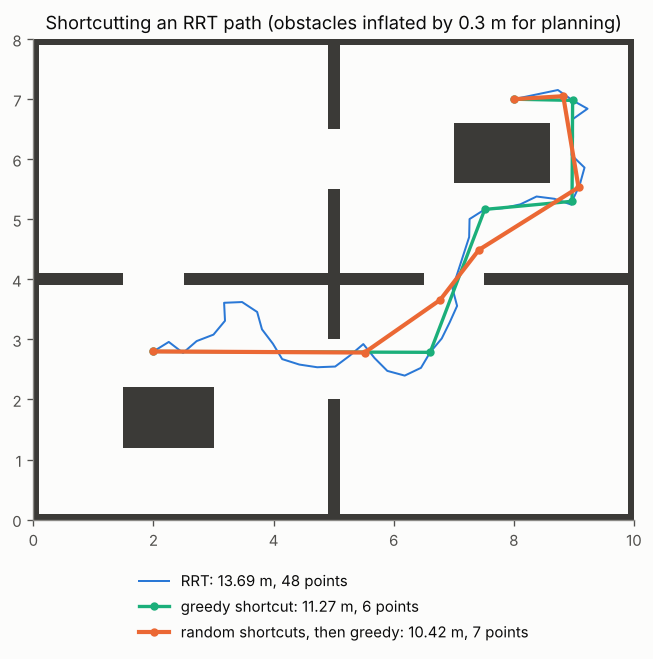
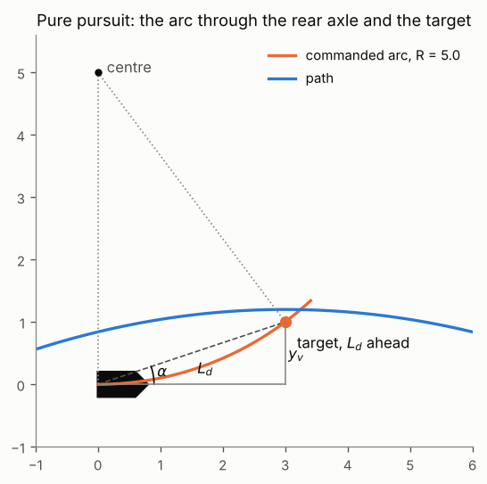
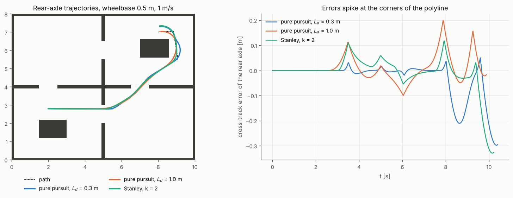

# 7 · Path smoothing and tracking

A planner hands over a polyline: the RRT path of chapter 5 is long and jagged, a grid path of chapter 4 is a
staircase. Two steps turn it into motion. *Smoothing* removes the planner's detours while staying collision-free;
*tracking* is the feedback law that makes a real vehicle — the kinematic bicycle of chapter 1 — follow the result
despite starting off the path and despite corners it cannot take exactly. This chapter covers shortcutting and the
two classic geometric trackers, pure pursuit and Stanley.

Code: [`tracking.hpp`](../cpp/include/motion_planning/tracking.hpp) ·
Tests: [`test_tracking.cpp`](../cpp/tests/test_tracking.cpp) ·
Notebook: [`07_smoothing_tracking.ipynb`](../2_notebooks/exercises/07_smoothing_tracking.ipynb)

## 7.1 Shortcutting

A path $p_0, \dots, p_n$ whose consecutive segments are collision-free can be shortened wherever two of its points
see each other: by the triangle inequality, replacing the stretch between them by the straight segment never makes
the path longer.

**Greedy shortcutting** ("string pulling"):

1. Keep $p_0$; set $i = 0$.
2. Find the largest $j > i$ such that the segment $p_i p_j$ is collision-free ($j = i + 1$ always qualifies).
3. Keep $p_j$, set $i = j$, and repeat until $p_n$ is kept.

It costs $O(n^2)$ segment checks in the worst case and only ever cuts between *vertices* of the original path.

**Random shortcutting:**

1. Pick two arc lengths $s_1 < s_2$ uniformly along the current path and take the points $a$, $b$ there.
2. If the segment $ab$ is collision-free, replace the stretch from $s_1$ to $s_2$ by it.
3. Repeat a fixed number of times.

Because $a$ and $b$ can lie inside segments, random shortcuts can cut corners the greedy pass cannot — in the
figure below they find a shorter path. They approach the best path only asymptotically, so a greedy pass at the
end removes the leftover kinks. Both keep every segment collision-free and both endpoints fixed (checked in
`test_tracking.cpp`).

*An RRT path through the rooms map before and after shortcutting. Figure:
`tools/figures/fig_07_smoothing_tracking.py`.*

Shortcutting yields a *shorter* polyline, not a smooth one: its corners are sharper, and the shortest path among
obstacles touches them (chapter 4). Plan on an inflated map (chapter 2) to leave a margin, because a tracker will
not follow the corners exactly. Curvature-continuous alternatives (splines, clothoids, or planning with Dubins
paths as in chapter 6) trade length for drivability.

## 7.2 Errors relative to a path

Parametrise the path by arc length $s$. For a point $p$ let $p^\perp(s^*)$ be the closest path point, $\theta_p$
the path heading there and $\mathbf n = (-\sin\theta_p, \cos\theta_p)$ the left normal. The *cross-track error*
and the *heading error* are

$$
e = \mathbf n^\top (p - p^\perp), \qquad \theta_e = \operatorname{wrap}(\theta_p - \theta),
\tag{7.1}
$$

with $e > 0$ when the point is left of the path. On a polyline the closest point is found segment by segment by
clamped orthogonal projection.

For a vehicle that drives the path exactly, $e = \theta_e = 0$; every tracker is a feedback law that drives
$(e, \theta_e)$ to zero. On a straight path, for the rear-axle bicycle (1.7) at speed $v$,

$$
\dot e = v \sin(-\theta_e) , \qquad \dot\theta_e = -\frac{v \tan\gamma}{L},
\tag{7.2}
$$

so the steering angle acts on $e$ only through the heading — a second-order, non-holonomic loop.

## 7.3 Pure pursuit

Pure pursuit chases a point a *lookahead distance* $L_d$ ahead along the path, from the projection of the rear axle.
It steers onto the circular arc that starts at the rear axle tangent to the heading and passes through that
target.

Let the target be at $(x_v, y_v)$ in the vehicle frame, $x_v^2 + y_v^2 = L_d^2$. The arc's centre lies on the
vehicle's $y$ axis at $(0, R)$, and the target is on the circle: $x_v^2 + (y_v - R)^2 = R^2$, so
$L_d^2 - 2 y_v R = 0$. With $y_v = L_d \sin\alpha$, where $\alpha$ is the bearing of the target,

$$
\kappa = \frac{1}{R} = \frac{2 y_v}{L_d^2} = \frac{2 \sin\alpha}{L_d}, \qquad
\gamma = \arctan(L\kappa).
\tag{7.3}
$$

The steering angle follows from the bicycle relation (1.6), $\kappa = \tan\gamma / L$.

**Worked example.** A target at $(3, 1)$ from the rear axle at the origin heading along $x$: $y_v = 1$,
$L_d^2 = 10$, $\kappa = 0.2$, the arc's radius is 5 and its centre is $(0, 5)$ — check: $3^2 + (1 - 5)^2 = 25$.
On a circular path of radius $R$, with the vehicle on it and the target $L_d$ further along the arc, (7.3) returns
exactly $1/R$, so pure pursuit holds a circle with zero error. (Both checked in `test_tracking.cpp`.)

**The lookahead is the only gain.** A short $L_d$ reacts fast and oscillates; a long one is smooth and cuts
corners, because the target is already round the bend. Since the right trade-off depends on speed, the lookahead
is usually scheduled:

$$
L_d = L_0 + k_v v .
\tag{7.4}
$$

Near a straight path, with small angles, $y_v \approx e$ and (7.3) becomes a proportional law on the cross-track
error with gain $2/L_d^2$: the error decays like a damped second-order system whose damping rises with $L_d$.

## 7.4 Stanley

The Stanley controller (from the DARPA Grand Challenge vehicle of the same name) measures errors at the *front*
axle and combines a heading term and a cross-track term:

$$
\gamma = \theta_e - \arctan\frac{k\, e}{k_s + v},
\tag{7.5}
$$

where $e$ and $\theta_e$ are those of (7.1) at the front axle, $k$ a gain [1/s] and $k_s$ a small softening speed
that keeps the law finite when stopped. The first term aligns the wheels with the path; the second steers towards
it, at an angle that saturates at $\pm\pi/2$ for large errors and shrinks as speed grows.

*Why it converges.* With the heading aligned ($\theta_e = 0$) the front wheel points at
$-\arctan(k e / v)$ to the path, so the front axle's lateral velocity is

$$
\dot e = -v \sin\left(\arctan\frac{k e}{v}\right) = -\frac{k e}{\sqrt{1 + (k e / v)^2}} \;\approx\; -k e
\quad \text{for small } e,
\tag{7.6}
$$

with $v$ here the speed of the front wheel: an exponential decay with time constant $1/k$, independent of speed
(Hoffmann et al. prove global convergence for this front-wheel kinematic model; on the rear-driven bicycle the
heading term makes the decay only approximately exponential). For large errors the decay is linear at speed $v$: the vehicle drives straight at
the path.

**Worked example.** Front axle 0.5 m left of a straight path, heading aligned, $k = 1$, $v = 2$ m/s, $k_s = 0$:
$\gamma = -\arctan(0.25) = -0.245$ rad, a right turn. (Checked in `test_tracking.cpp`.)

*Pure pursuit with two lookaheads and Stanley on the shortcut path. Every controller leaves the path at the
polyline's corners, where the required curvature is infinite.*

## 7.5 Algorithm: tracking a path

1. Smooth the planner's path (section 7.1), on a map inflated by more than the expected tracking error.
2. Each control period, project the reference point onto the path (7.1): the rear axle for pure pursuit, the front
   axle for Stanley.
3. Compute the steering angle: (7.3) with the target $L_d$ ahead (7.4), or (7.5).
4. Saturate and rate-limit it (1.17) — the actuator has limits — and apply it with the speed.
5. Stop when the projection reaches the end of the path.

## Common mistakes

- **Sign conventions.** Decide once whether $e > 0$ means left, and derive the law with that sign; a sign error
  makes the controller steer away from the path.
- **Projecting the wrong point.** Pure pursuit is derived for the rear axle (the point that moves along the
  heading), Stanley for the front axle.
- **Tracking a polyline with sharp corners.** Every tracker overshoots them; shorten the lookahead, slow down, or
  smooth the path into something with bounded curvature.
- **Ignoring the steering rate.** A slow actuator turns a well-tuned law into an oscillating one.
- **Lookahead past the end of the path.** Clamp the target to the end point, or the vehicle circles the goal.
- **Smoothing without re-checking collisions.** Every new segment must pass the same `motion_valid` as the planner's.

## References

- R. C. Coulter, "Implementation of the pure pursuit path tracking algorithm", Technical report CMU-RI-TR-92-01,
  Carnegie Mellon University, 1992.
- S. Thrun et al., "Stanley: the robot that won the DARPA Grand Challenge", *Journal of Field Robotics* 23(9), 2006.
- G. M. Hoffmann, C. J. Tomlin, M. Montemerlo, S. Thrun, "Autonomous automobile trajectory tracking for off-road
  driving: controller design, experimental validation and racing", *American Control Conference*, 2007.
- J. M. Snider, "Automatic steering methods for autonomous automobile path tracking", Technical report
  CMU-RI-TR-09-08, Carnegie Mellon University, 2009 — a comparison of pure pursuit, Stanley and others.
- R. Geraerts, M. H. Overmars, "Creating high-quality paths for motion planning", *International Journal of
  Robotics Research* 26(8), 2007 — shortcutting.
- P. Corke, *Robotics, Vision and Control*, 2nd ed., Springer, 2017 — §4.1.2: following a path.
