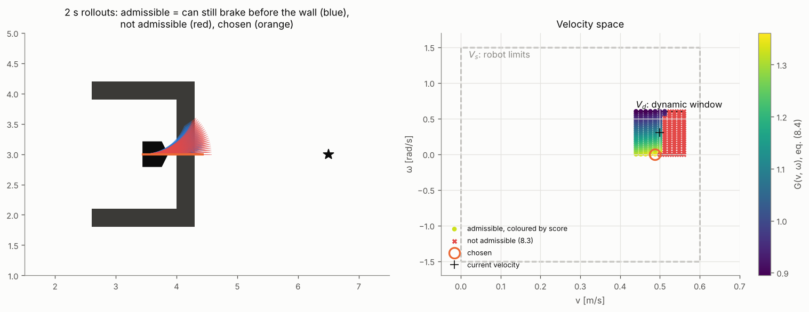
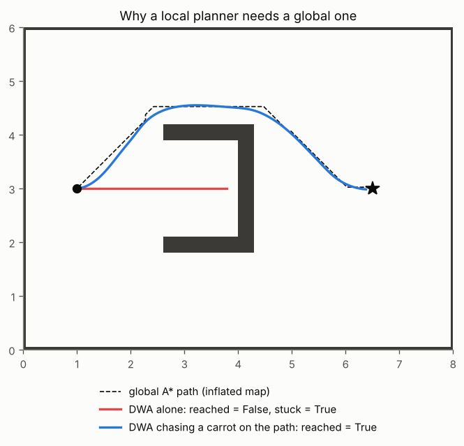

# 8 · Local planning: the Dynamic Window Approach

Global planners (chapters 3–6) assume a map that is right and a robot that follows the plan. Neither holds for
long: people walk into corridors, maps are incomplete, motors cannot change speed instantly. A *local planner*
runs at the control rate, looks a second or two ahead, and picks velocity commands that are safe *now* and that
make progress. This chapter derives the Dynamic Window Approach (DWA), the classic local planner for
differential-drive robots, shows how it fails on its own, and how a global plan fixes that.

Code: [`dwa.hpp`](../cpp/include/motion_planning/dwa.hpp) ·
Tests: [`test_dwa.cpp`](../cpp/tests/test_dwa.cpp) ·
Notebook: [`08_local_planning.ipynb`](../2_notebooks/exercises/08_local_planning.ipynb)

## 8.1 Searching in velocity space

A differential-drive robot is commanded with $(v, \omega)$ (chapter 1, eqs. 1.2–1.4). DWA searches directly over
these commands instead of over paths: if $(v, \omega)$ is held for the next $T$ seconds, the robot drives a circular
arc of radius $v/\omega$, computed exactly by (1.16). Each candidate command is therefore a candidate *trajectory*,
and the search space is two-dimensional whatever the map.

The commands the robot could ever execute form a rectangle,

$$
V_s = [v_\text{min}, v_\text{max}] \times [-\omega_\text{max}, \omega_\text{max}] .
\tag{8.1}
$$

**The dynamic window.** Motors have finite acceleration. Within one control period $\Delta t$ from the current
$(v_c, \omega_c)$, only

$$
V_d = [v_c - \dot v_b \Delta t,\ v_c + \dot v_a \Delta t] \times [\omega_c - \dot\omega \Delta t,\ \omega_c + \dot\omega \Delta t]
\tag{8.2}
$$

is reachable, with $\dot v_a$, $\dot v_b$ the maximum acceleration and braking and $\dot\omega$ the maximum angular
acceleration. The search is restricted to $V_s \cap V_d$, which is what makes the approach *dynamic*: a robot at
full speed cannot choose to stop, and DWA does not pretend it can.

**Worked example.** At $(v_c, \omega_c) = (0.2\ \text{m/s}, 0)$ with $\dot v = 0.6$ m/s², $\dot\omega = 3$ rad/s²
and $\Delta t = 0.1$ s, the window is $v \in [0.14, 0.26]$ m/s, $\omega \in [-0.3, 0.3]$ rad/s. (Checked in
`test_dwa.cpp`.)

## 8.2 Admissible velocities

A command is safe if, should an obstacle lie on its arc, the robot can still brake to a stop before reaching it.
Let $d(v, \omega)$ be the distance driven along the arc before the robot's disc first touches an obstacle
($\infty$ if it never does within the horizon). Braking at $\dot v_b$ from speed $v$ needs $v^2/(2\dot v_b)$, so
the admissible set is

$$
V_a = \left\{ (v, \omega) : v^2 \le 2\, \dot v_b\, d(v, \omega) \right\}.
\tag{8.3}
$$

In code, $d$ is found by stepping along the arc every $\Delta t_\text{sim}$ and looking up the distance transform
of chapter 2: the disc collides where the distance to the nearest obstacle is at most the robot radius. Both
the samples and the cells quantise $d$; a margin of two samples plus one cell is subtracted from it, so that the
braking guarantee survives from one decision to the next (without it the robot can creep into the collision band
— see "Common mistakes").

## 8.3 The objective

Among the admissible commands in the window, DWA maximises a weighted sum

$$
G(v, \omega) = \alpha\, \text{heading}(v, \omega) + \beta\, \text{dist}(v, \omega) + \gamma\, \text{velocity}(v, \omega),
\tag{8.4}
$$

each term scaled to $[0, 1]$:

- **heading** $= 1 - |\text{bearing error to the goal}| / \pi$, evaluated where the rollout comes *closest* to the
  goal (1 if it reaches it). Fox et al. evaluate it at the end of the rollout; near the goal every forward arc then
  drives past the goal and ends facing away, so stopping wins and the robot stalls just short of the goal.
- **dist** $= \min(d(v, \omega), d_\text{cap}) / d_\text{cap}$: the free distance along the arc, as in Fox et al.
  It rewards arcs that stay free over the horizon. (A tempting alternative — the smallest *lateral* clearance along
  the rollout — rewards standing still in open space, and the robot creeps to a stop.)
- **velocity** $= v / v_\text{max}$: prefer making progress.

**Algorithm (one DWA step).**

1. Compute the window $V_s \cap V_d$ (8.1)–(8.2) and sample it on an $n_v \times n_\omega$ grid.
2. For each $(v, \omega)$: roll out the exact arc for the horizon; find $d(v, \omega)$; discard it unless (8.3) holds;
   score it with (8.4).
3. Send the best command. If none is admissible, brake as hard as allowed.

Repeat every control period, from the robot's *measured* state: DWA is a receding-horizon controller.

*Left: the arcs of all candidate commands for a robot driving at 0.5 m/s towards the back wall of a U. Right: the
same candidates in velocity space; the dynamic window is the small rectangle around the current velocity, and the
faster commands are not admissible because the robot could no longer stop before the wall. Figure:
`tools/figures/fig_08_local_planning.py`.*

## 8.4 Why a local planner needs a global one

DWA looks only two seconds ahead and steers by the straight-line bearing to the goal. Anything that requires
first moving *away* from the goal is invisible to it. In front of a U-shaped obstacle the heading term pulls the
robot into the U, the admissibility condition stops it at the back wall, and every command that would lead out
scores worse than staying: a local minimum, exactly as for the potential fields of chapter 3.

The standard architecture splits the work:

- a **global planner** (A* on the inflated map, chapter 4, or a sampling planner, chapter 5) computes a path
  through the known map, at a low rate or when the map changes;
- the **local planner** follows it at the control rate, using as its goal a *carrot* a distance $\ell$ ahead of the
  robot's projection onto the global path (chapter 7):

$$
g_\text{local} = \pi\big(s^* + \ell\big), \qquad s^* = \arg\min_s \lVert \pi(s) - p \rVert ,
\tag{8.5}
$$

where $\pi(s)$ is the path parametrised by arc length. The global path supplies the topology (which side of the U),
DWA supplies dynamic feasibility and reacts to obstacles the map did not contain.

The carrot distance matters: if the carrot jumps round a corner of the global path, the straight bearing to it
cuts that corner, and DWA can pin the robot against the obstacle the path was going round. Keep $\ell$ short
compared with the distance between corners of the global path, or follow the path with a tracking term instead of
a bearing.

*DWA alone drives into the U and stays there; the same DWA chasing a carrot 0.6 m ahead on an A* path goes round.*

## Common mistakes

- **Ignoring the window.** Sampling all of $V_s$ produces commands the motors cannot execute; the executed motion
  then differs from the evaluated one.
- **Treating the full rollout as the plan.** Only the first control period is executed; the rest only scores the
  command. Rollouts that pass through a wall can be admissible — the robot will brake before it.
- **No margin in (8.3).** Quantised free distances shrink unpredictably between decisions; without a margin the
  "can still brake" guarantee breaks and the robot enters the collision band, where nothing is admissible.
- **Heading at the end of the rollout.** Near the goal, every arc overshoots and the robot stalls.
- **Lateral clearance as the obstacle term.** Standing still maximises it; the robot creeps to a stop in open space.
- **DWA without a global planner.** Local minima are guaranteed in buildings.
- **A carrot too far ahead.** It cuts the global path's corners.

## References

- D. Fox, W. Burgard, S. Thrun, "The dynamic window approach to collision avoidance", *IEEE Robotics & Automation
  Magazine* 4(1), 1997.
- O. Brock, O. Khatib, "High-speed navigation using the global dynamic window approach", *IEEE International
  Conference on Robotics and Automation*, 1999 — DWA guided by a navigation function.
- R. Siegwart, I. R. Nourbakhsh, D. Scaramuzza, *Introduction to Autonomous Mobile Robots*, 2nd ed., MIT Press,
  2011 — §6.4: obstacle avoidance, including DWA.
- E. Marder-Eppstein, E. Berger, T. Foote, B. Gerkey, K. Konolige, "The office marathon: robust navigation in an
  indoor office environment", *IEEE International Conference on Robotics and Automation*, 2010 — the global/local
  architecture of the ROS navigation stack.
- S. Thrun, W. Burgard, D. Fox, *Probabilistic Robotics*, MIT Press, 2005 — ch. 5: velocity motion model.
