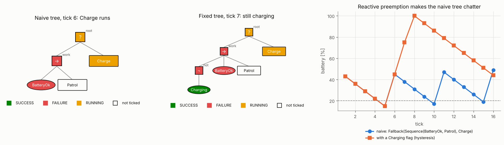

# 9 · Behaviour trees

Part I produced capabilities: plan a path, track it, avoid what the map missed. A robot doing a job must also
decide *which* capability to run *when*: patrol, but recharge before the battery dies; pick up the box, but stop
if a person steps in. Behaviour trees (BTs) are the standard way to write that decision logic in robotics — they
came from game AI, and the ROS 2 navigation stack is driven by one. This chapter defines their semantics
precisely, builds a small engine in C++, and works through the design mistakes that every first BT makes.

Code: [`behavior_tree.hpp`](../cpp/include/motion_planning/behavior_tree.hpp) ·
Tests: [`test_behavior_tree.cpp`](../cpp/tests/test_behavior_tree.cpp) ·
Notebook: [`09_behavior_trees.ipynb`](../2_notebooks/exercises/09_behavior_trees.ipynb)

## 9.1 Ticks and statuses

A BT is a rooted tree. Its *leaves* are the capabilities: **conditions** (is the battery above 20 %?) and
**actions** (drive to the dock). Its *inner nodes* only decide which leaves to run. Execution proceeds in
**ticks**: at a fixed rate the root is ticked; a ticked node does a bounded amount of work, ticks some of its
children, and returns one of three statuses,

$$
\text{Status} \in \{\text{SUCCESS}, \text{FAILURE}, \text{RUNNING}\}.
$$

RUNNING is what makes BTs useful for robots: an action that takes time (driving to the dock) returns RUNNING
every tick until it is done, and the tree is re-evaluated from the root at every tick in between. A condition
answers immediately and never returns RUNNING.

## 9.2 Composites

**Sequence** ($\rightarrow$, "do all of these, in order"). Tick the children $c_1, \dots, c_n$ left to right and stop
at the first that does not succeed:

$$
\text{Sequence}(c_1, \dots, c_n) =
\begin{cases}
s_i & \text{for the first } i \text{ with } s_i = \text{tick}(c_i) \ne \text{SUCCESS}, \\
\text{SUCCESS} & \text{if every child succeeds.}
\end{cases}
\tag{9.1}
$$

**Fallback** (?, also called selector, "try these, in order of preference"). The dual: stop at the first child that
does not fail,

$$
\text{Fallback}(c_1, \dots, c_n) =
\begin{cases}
s_i & \text{for the first } i \text{ with } s_i = \text{tick}(c_i) \ne \text{FAILURE}, \\
\text{FAILURE} & \text{if every child fails.}
\end{cases}
\tag{9.2}
$$

Children after the deciding one are not ticked. A Sequence of conditions is a logical AND, a Fallback an OR, with
short-circuit evaluation; with actions in them, they become an if-then and a prioritised list of alternatives.

**Parallel** ($\rightrightarrows$) ticks all $n$ children every tick and succeeds when at least $M$ of them have
succeeded:

$$
\text{Parallel}_M =
\begin{cases}
\text{SUCCESS} & \#\text{SUCCESS} \ge M, \\
\text{FAILURE} & \#\text{FAILURE} > n - M, \\
\text{RUNNING} & \text{otherwise},
\end{cases}
\tag{9.3}
$$

the failure condition being "$M$ successes can no longer be reached". Once it decides, still-running children are
halted. ("Monitor the bumper *while* driving" is a Parallel.)

## 9.3 Reactivity, memory and halting

Because the tree is re-ticked from the root, a Sequence normally re-checks its first children every tick — it is
*reactive*. In `Sequence(BatteryOk, Patrol)`, if the battery drops while Patrol is RUNNING, the next tick finds
`BatteryOk` failing and the Sequence fails without ticking Patrol. Patrol was running; somebody must stop it.
That is **halting**: when a composite stops ticking a child that was RUNNING, it calls `halt()` on it, and the
action stops its motors, cancels its plan, resets its counters.

A composite *with memory* ($\rightarrow^*$, ?$^*$) instead remembers its running child and resumes there on the
next tick, skipping the children before it. Memory is right for steps that must not be repeated (a pick-and-place
sequence whose first step "open the gripper" has already been done); it is wrong for anything that must keep
watching a condition.

**Worked example** (checked in `test_behavior_tree.cpp`). The condition BatteryOk holds for two ticks and then
fails; Patrol is always RUNNING.

| tick | reactive `Sequence(BatteryOk, Patrol)` | with memory `Sequence*(BatteryOk, Patrol)` |
|---|---|---|
| 1 | BatteryOk ✓, Patrol … → RUNNING | BatteryOk ✓, Patrol … → RUNNING |
| 2 | BatteryOk ✓, Patrol … → RUNNING | Patrol … → RUNNING |
| 3 | BatteryOk ✗ → FAILURE, **Patrol halted** | Patrol … (the low battery is never seen) |

The reactive sequence ticks the condition three times and Patrol twice; the one with memory ticks the condition once.

The same holds for a reactive Fallback: a higher-priority child that starts succeeding or running *preempts* a
lower-priority running child, which is halted.

## 9.4 Decorators, leaves and the blackboard

**Decorators** have one child and change its status or how often it is ticked: Inverter (swap SUCCESS and
FAILURE), Retry $n$ (re-tick a failing child up to $n$ times), Repeat $n$ (tick a succeeding child $n$ times),
Timeout $n$ (fail and halt the child if it has been RUNNING for $n$ ticks), ForceSuccess/ForceFailure.

**The blackboard** is a key–value store shared by the leaves of a tree: sensors write `battery`, a planner writes
`path`, conditions read them. It decouples leaves from each other, at the price of hidden data flow — every key
should have one writer.

## 9.5 Designing with BTs

A BT replaces the transitions of a finite-state machine by structure: no node knows who ticks it or what runs
next, so subtrees can be moved, reused and tested alone. Two patterns cover most robot logic.

**Implicit sequence / postcondition–precondition–action (PPA).** To achieve a goal condition $C$: try $C$ first,
and only if it fails run an action whose postcondition is $C$, after ensuring that action's preconditions,

$$
\text{Fallback}\big(C,\ \text{Sequence}(\text{pre}_1, \dots, \text{pre}_k, A)\big),
\tag{9.4}
$$

and expand each precondition the same way. The tree then automatically skips steps already achieved and redoes
steps that something undid — reactivity for free.

**Priorities by order.** In a Fallback, safety behaviours go left, the job goes right.

**Worked example: the chattering mission.** `Fallback(Sequence(BatteryOk, Patrol), Charge)` with BatteryOk = battery
$\ge$ 20 %, Patrol draining 7 % per tick and Charge adding 30 % per tick until full. From 50 %: 43, 36, 29, 22, 15 —
then one tick of Charge (45 %) brings BatteryOk back, the reactive Fallback preempts Charge, and the robot is
back on patrol at 38 %. It never charges fully. The fix is hysteresis: Charge writes `charging = true` until the
battery is full, and the work branch requires `not charging`. Then the battery goes 15, 45, 75, 100, and patrol
resumes at 93 %. (Both traces are checked in `test_behavior_tree.cpp`.)

*Left and centre: the naive and the fixed tree during charging, coloured by each node's status at that tick. Right:
the battery under both. Figure: `tools/figures/fig_09_behavior_trees.py`.*

## 9.6 Algorithm: running a tree

1. Build the tree and initialise the blackboard.
2. Every control period: update the blackboard from sensors; tick the root once.
3. Inside a tick, each composite applies (9.1)–(9.3), halting any child that was RUNNING and is no longer ticked.
4. Stop when the root returns SUCCESS or FAILURE (or never, for a robot that runs forever).

Every leaf must return quickly: a long computation inside a tick blocks the whole tree. Long work runs
asynchronously and reports RUNNING until it is done.

## Common mistakes

- **Reactive where memory was needed (and vice versa).** A sequence with memory never notices that a condition
  became false; a reactive one repeats steps whose effect it does not check.
- **No halt.** An action preempted without a halt keeps its motors running and its counters half-way.
- **Conditions that flip on the boundary.** Without hysteresis a reactive tree chatters between branches.
- **Long work inside a tick.** Planning for a second inside an action freezes every other branch, including safety.
- **Blackboard keys written in several places.** Data flow becomes impossible to follow.
- **Using a Parallel for ordering.** It runs children concurrently; ordering is the Sequence's job.

## References

- M. Colledanchise, P. Ögren, *Behavior Trees in Robotics and AI: An Introduction*, CRC Press, 2018 — the
  definitions above, the PPA pattern, and the comparison with state machines.
- M. Colledanchise, P. Ögren, "How behavior trees modularize hybrid control systems and generalize sequential
  behavior compositions, the subsumption architecture, and decision trees", *IEEE Transactions on Robotics* 33(2),
  2017.
- M. Iovino, E. Scukins, J. Styrud, P. Ögren, C. Smith, "A survey of behavior trees in robotics and AI", *Robotics
  and Autonomous Systems* 154, 2022.
- S. Macenski, F. Martín, R. White, J. Ginés Clavero, "The Marathon 2: a navigation system", *IEEE/RSJ International
  Conference on Intelligent Robots and Systems*, 2020 — BTs in the ROS 2 navigation stack.
- D. Isla, "Handling complexity in the Halo 2 AI", *Game Developers Conference*, 2005 — the origin in games.
